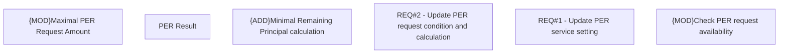

# CBL-28112 (CSI-4215) PER setting and calculation update

```mermaid
graph TD
    MOD_Maximal_PER_Request_Amount["{MOD}Maximal PER Request Amount"]
    PER_Result["PER Result"]
    ADD_Minimal_Remaining_Principal_calculation["{ADD}Minimal Remaining Principal calculation"]
    REQ_2_Update_PER_request_condition_and_calculation["REQ#2 - Update PER request condition and calculation"]
    REQ_1_Update_PER_service_setting["REQ#1 - Update PER service setting"]
    MOD_Check_PER_request_availability["{MOD}Check PER request availability"]
```
