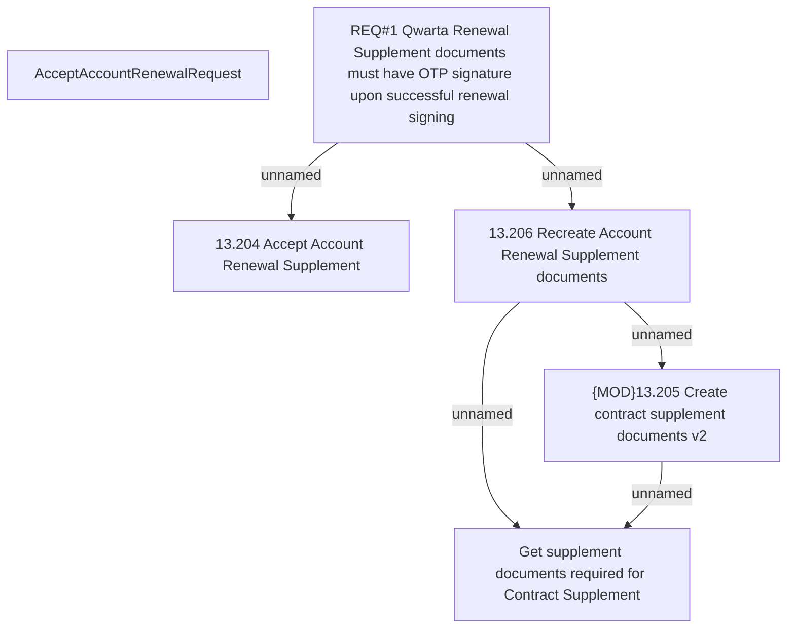

# One Level Requirement Hierarchy

```mermaid
graph TD
    Get_supplement_documents_required_for_Contract_Supplement["Get supplement documents required for Contract Supplement"]
    n_13_204_Accept_Account_Renewal_Supplement["13.204 Accept Account Renewal Supplement"]
    AcceptAccountRenewalRequest["AcceptAccountRenewalRequest"]
    n_13_206_Recreate_Account_Renewal_Supplement_documents["13.206 Recreate Account Renewal Supplement documents"]
    REQ_1_Qwarta_Renewal_Supplement_documents_must_have_OTP_sign["REQ#1 Qwarta Renewal Supplement documents must have OTP signature upon successful renewal signing"]
    MOD_13_205_Create_contract_supplement_documents_v2["{MOD}13.205 Create contract supplement documents v2"]
    REQ_1_Qwarta_Renewal_Supplement_documents_must_have_OTP_sign -->|unnamed| n_13_206_Recreate_Account_Renewal_Supplement_documents
    REQ_1_Qwarta_Renewal_Supplement_documents_must_have_OTP_sign -->|unnamed| n_13_204_Accept_Account_Renewal_Supplement
    n_13_206_Recreate_Account_Renewal_Supplement_documents -->|unnamed| Get_supplement_documents_required_for_Contract_Supplement
    n_13_206_Recreate_Account_Renewal_Supplement_documents -->|unnamed| MOD_13_205_Create_contract_supplement_documents_v2
    MOD_13_205_Create_contract_supplement_documents_v2 -->|unnamed| Get_supplement_documents_required_for_Contract_Supplement
```
