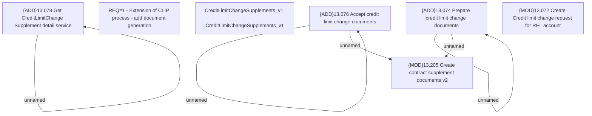

# CBL-28958 (CSI-4104) Transition of HPL Product to Committed Line

- **Diagram Type**: Custom
- **Package**: HomerSelect/BSL/Requirements Model/In process/CSI/CBL-28958 (CSI-4104) Transition of HPL Product to Committed Line
- **Diagram ID**: 162994
- **Elements**: 10
- **Connectors**: 5

