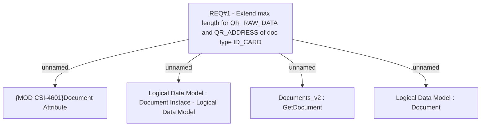

# CBL-29217 (CSI-4601) Extend maximum length for QR_RAW_DATA and QR_ADDRESS of document type ID_CARD

- **Diagram Type**: Custom
- **Package**: HomerSelect/BSL/Requirements Model/In process/CSI/CBL-29217 (CSI-4601) Extend maximum length for QR_RAW_DATA and QR_ADDRESS of document type ID_CARD
- **Diagram ID**: 164701
- **Elements**: 5
- **Connectors**: 4

