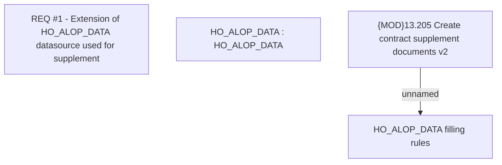

# CBL-29660 (CSI-4244) Sending Commodity Type and Down Payment to HO_ALOP_DATA

- **Diagram Type**: Custom
- **Package**: HomerSelect/BSL/Requirements Model/In process/CSI/CBL-29660 (CSI-4244) Sending Commodity Type and Down Payment to HO_ALOP_DATA
- **Diagram ID**: 163893
- **Elements**: 4
- **Connectors**: 1

