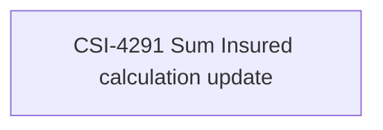

# CBL-31091 (CSI-4288) - Adding Insurances and Services to Existing Contract in POS Loan and Cash Loan - Sum Insured calculation

- **Diagram Type**: Custom
- **Package**: HomerSelect/BSL/Requirements Model/In process/CSI/CBL-31091 (CSI-4288) - Adding Insurances and Services to Existing Contract in POS Loan and Cash Loan - Sum Insured calculation
- **Diagram ID**: 164210
- **Elements**: 1
- **Connectors**: 0

