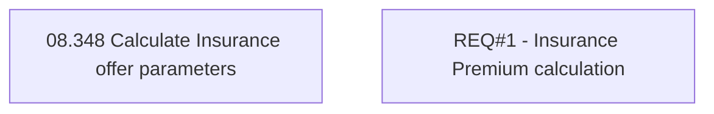

# CBL-31227 (CSI-4312) Adding Insurance to Active Contracts - Insurance Premium calculation

- **Diagram Type**: Custom
- **Package**: HomerSelect/BSL/Requirements Model/In process/CSI/CBL-31227 (CSI-4312) Adding Insurance to Active Contracts - Insurance Premium calculation
- **Diagram ID**: 164678
- **Elements**: 2
- **Connectors**: 0

