# PAYM-1012 (CBL-3001) Ready for Disbursement Date Filter on Browse Outgoing Payment

- **Diagram Type**: Custom
- **Package**: HomerSelect/BSL/Requirements Model/In process/ISPAY/PAYM-1012 (CBL-3001) Ready for Disbursement Date Filter on Browse Outgoing Payment
- **Diagram ID**: 101726
- **Elements**: 28
- **Connectors**: 25

```mermaid
graph TD
    MOD_Generate_outgoing_payment_for_contract["{MOD}Generate outgoing payment for contract"]
    MOD_Rules_for_Entering_Outgoing_Payment_Search_criteria_PART["{MOD}Rules for Entering Outgoing Payment Search criteria - PARTNER"]
    MOD_Rules_for_Entering_Outgoing_Payment_Search_criteria_ORIG["{MOD}Rules for Entering Outgoing Payment Search criteria - ORIGINATING POS"]
    MOD_Rules_for_Entering_Outgoing_Payment_Search_criteria_STAN["{MOD}Rules for Entering Outgoing Payment Search criteria - STANDARD"]
    MOD_Rules_for_Entering_Outgoing_Payment_Search_criteria_POS["{MOD}Rules for Entering Outgoing Payment Search criteria - POS"]
    MOD_Rules_for_Entering_Outgoing_Payment_Search_criteria_UNPA["{MOD}Rules for Entering Outgoing Payment Search criteria - UNPAID"]
    MOD_Rules_for_Entering_Outgoing_Payment_Search_criteria_CUST["{MOD}Rules for Entering Outgoing Payment Search criteria - CUSTOM"]
    MOD_Rules_for_Entering_Outgoing_Payment_Search_criteria_CANC["{MOD}Rules for Entering Outgoing Payment Search criteria - CANCELED"]
    MOD_Rules_for_Entering_Outgoing_Payment_Search_criteria_BLOC["{MOD}Rules for Entering Outgoing Payment Search criteria - BLOCKED"]
    MOD_Evaluation_of_Outgoing_Payment_Search_criteria_STANDARD["{MOD}Evaluation of Outgoing Payment Search criteria - STANDARD"]
    MOD_Evaluation_of_Outgoing_Payment_Search_criteria_POS["{MOD}Evaluation of Outgoing Payment Search criteria - POS"]
    MOD_Evaluation_of_Outgoing_Payment_Search_criteria_UNPAID["{MOD}Evaluation of Outgoing Payment Search criteria - UNPAID"]
    MOD_Evaluation_of_Outgoing_Payment_Search_criteria_CUSTOM["{MOD}Evaluation of Outgoing Payment Search criteria - CUSTOM"]
    MOD_Evaluation_of_Outgoing_Payment_Search_criteria_CANCELED["{MOD}Evaluation of Outgoing Payment Search criteria - CANCELED"]
    MOD_Evaluation_of_Outgoing_Payment_Search_criteria_BLOCKED["{MOD}Evaluation of Outgoing Payment Search criteria - BLOCKED"]
    MOD_Evaluation_of_Outgoing_Payment_Search_criteria_PARTNER["{MOD}Evaluation of Outgoing Payment Search criteria - PARTNER"]
    MOD_Evaluation_of_Outgoing_Payment_Search_criteria_ORIGINATI["{MOD}Evaluation of Outgoing Payment Search criteria - ORIGINATING POS"]
    Logical_Data_Model_Outgoing_Payments["Logical Data Model : Outgoing Payments"]
    User_Interface_model_Search_criteria_CUSTOM["User Interface model : Search criteria - CUSTOM"]
    User_Interface_model_Search_criteria_POS["User Interface model : Search criteria - POS"]
    User_Interface_model_Search_criteria_UNPAID["User Interface model : Search criteria - UNPAID"]
    User_Interface_model_Search_criteria_STANDARD["User Interface model : Search criteria - STANDARD"]
    User_Interface_model_Search_criteria_BLOCKED["User Interface model : Search criteria - BLOCKED"]
    User_Interface_model_Search_criteria_CANCELED["User Interface model : Search criteria - CANCELED"]
    User_Interface_model_Search_criteria_PARTNER["User Interface model : Search criteria - PARTNER"]
    User_Interface_model_Search_criteria_ORIGINATING_POS["User Interface model : Search criteria - ORIGINATING POS"]
    REQ_2_Add_Ready_for_disbursement_date_into_outgoing_payments["REQ#2 - Add 'Ready for disbursement' date into outgoing payments search criteria "]
    REQ1_Add_Ready_for_disbursement_date_into_OutgoingPayment["REQ1 - Add 'Ready for disbursement' date into OutgoingPayment"]
    REQ_2_Add_Ready_for_disbursement_date_into_outgoing_payments -->|unnamed| MOD_Evaluation_of_Outgoing_Payment_Search_criteria_BLOCKED
    REQ_2_Add_Ready_for_disbursement_date_into_outgoing_payments -->|unnamed| User_Interface_model_Search_criteria_ORIGINATING_POS
    REQ_2_Add_Ready_for_disbursement_date_into_outgoing_payments -->|unnamed| User_Interface_model_Search_criteria_PARTNER
    REQ_2_Add_Ready_for_disbursement_date_into_outgoing_payments -->|unnamed| User_Interface_model_Search_criteria_CANCELED
    REQ_2_Add_Ready_for_disbursement_date_into_outgoing_payments -->|unnamed| User_Interface_model_Search_criteria_BLOCKED
    REQ_2_Add_Ready_for_disbursement_date_into_outgoing_payments -->|unnamed| User_Interface_model_Search_criteria_STANDARD
    REQ_2_Add_Ready_for_disbursement_date_into_outgoing_payments -->|unnamed| User_Interface_model_Search_criteria_UNPAID
    REQ_2_Add_Ready_for_disbursement_date_into_outgoing_payments -->|unnamed| User_Interface_model_Search_criteria_POS
    REQ_2_Add_Ready_for_disbursement_date_into_outgoing_payments -->|unnamed| User_Interface_model_Search_criteria_CUSTOM
    REQ1_Add_Ready_for_disbursement_date_into_OutgoingPayment -->|unnamed| Logical_Data_Model_Outgoing_Payments
    REQ_2_Add_Ready_for_disbursement_date_into_outgoing_payments -->|unnamed| MOD_Evaluation_of_Outgoing_Payment_Search_criteria_PARTNER
    REQ_2_Add_Ready_for_disbursement_date_into_outgoing_payments -->|unnamed| MOD_Rules_for_Entering_Outgoing_Payment_Search_criteria_PART
    REQ_2_Add_Ready_for_disbursement_date_into_outgoing_payments -->|unnamed| MOD_Evaluation_of_Outgoing_Payment_Search_criteria_CANCELED
    REQ_2_Add_Ready_for_disbursement_date_into_outgoing_payments -->|unnamed| MOD_Evaluation_of_Outgoing_Payment_Search_criteria_CUSTOM
    REQ_2_Add_Ready_for_disbursement_date_into_outgoing_payments -->|unnamed| MOD_Evaluation_of_Outgoing_Payment_Search_criteria_UNPAID
    REQ_2_Add_Ready_for_disbursement_date_into_outgoing_payments -->|unnamed| MOD_Evaluation_of_Outgoing_Payment_Search_criteria_POS
    REQ_2_Add_Ready_for_disbursement_date_into_outgoing_payments -->|unnamed| MOD_Evaluation_of_Outgoing_Payment_Search_criteria_STANDARD
    REQ_2_Add_Ready_for_disbursement_date_into_outgoing_payments -->|unnamed| MOD_Rules_for_Entering_Outgoing_Payment_Search_criteria_BLOC
    REQ_2_Add_Ready_for_disbursement_date_into_outgoing_payments -->|unnamed| MOD_Rules_for_Entering_Outgoing_Payment_Search_criteria_CANC
    REQ_2_Add_Ready_for_disbursement_date_into_outgoing_payments -->|unnamed| MOD_Rules_for_Entering_Outgoing_Payment_Search_criteria_UNPA
    REQ_2_Add_Ready_for_disbursement_date_into_outgoing_payments -->|unnamed| MOD_Rules_for_Entering_Outgoing_Payment_Search_criteria_POS
    REQ_2_Add_Ready_for_disbursement_date_into_outgoing_payments -->|unnamed| MOD_Rules_for_Entering_Outgoing_Payment_Search_criteria_STAN
    REQ_2_Add_Ready_for_disbursement_date_into_outgoing_payments -->|unnamed| MOD_Rules_for_Entering_Outgoing_Payment_Search_criteria_ORIG
    REQ_2_Add_Ready_for_disbursement_date_into_outgoing_payments -->|unnamed| MOD_Evaluation_of_Outgoing_Payment_Search_criteria_ORIGINATI
    MOD_Rules_for_Entering_Outgoing_Payment_Search_criteria_CUST -->|unnamed| REQ_2_Add_Ready_for_disbursement_date_into_outgoing_payments
```

