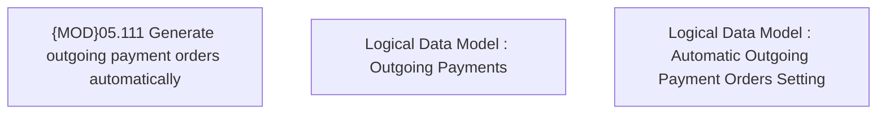

# PAYM-1016 (CBL-2763) IN HCPAY - Instant disbursement of outgoing payments

- **Diagram Type**: Custom
- **Package**: HomerSelect/BSL/Requirements Model/In process/ISPAY/PAYM-1016 (CBL-2763) IN HCPAY - Instant disbursement of outgoing payments
- **Diagram ID**: 102898
- **Elements**: 3
- **Connectors**: 0

