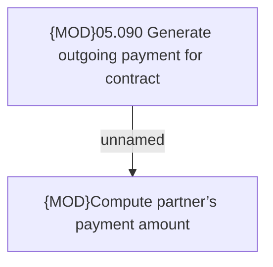

# CBL-3091 Cash payment deduction driven by a new parameter

- **Diagram Type**: Custom
- **Package**: HomerSelect/BSL/Requirements Model/In process/ISPAY/PAYM-1049 (CBL-3091) Cash payment deduction driven by a new parameter
- **Diagram ID**: 102775
- **Elements**: 2
- **Connectors**: 1

