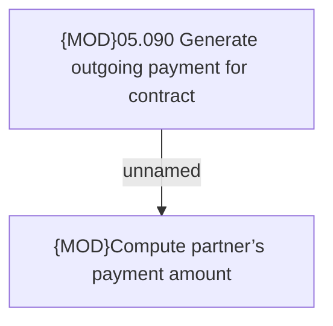

# CBL-3091 Cash payment deduction driven by a new parameter

```mermaid
graph TD
    MOD_05_090_Generate_outgoing_payment_for_contract["{MOD}05.090 Generate outgoing payment for contract"]
    MOD_Compute_partner_s_payment_amount["{MOD}Compute partner’s payment amount"]
    MOD_05_090_Generate_outgoing_payment_for_contract -->|unnamed| MOD_Compute_partner_s_payment_amount
```
