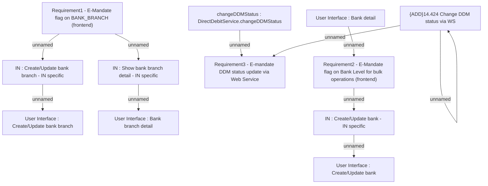

# PAYM-1072 (CBL-2505) - HoSel e-mandate support - reporting and maintenance

```mermaid
graph TD
    User_Interface_Bank_detail["User Interface : Bank detail"]
    User_Interface_Create_Update_bank["User Interface : Create/Update bank"]
    User_Interface_Create_Update_bank_branch["User Interface : Create/Update bank branch"]
    User_Interface_Bank_branch_detail["User Interface : Bank branch detail"]
    IN_Show_bank_branch_detail_IN_specific["IN : Show bank branch detail - IN specific"]
    IN_Create_Update_bank_branch_IN_specific["IN : Create/Update bank branch - IN specific"]
    IN_Create_Update_bank_IN_specific["IN : Create/Update bank - IN specific"]
    changeDDMStatus_DirectDebitService_changeDDMStatus["changeDDMStatus : DirectDebitService.changeDDMStatus"]
    ADD_14_424_Change_DDM_status_via_WS["{ADD}14.424 Change DDM status via WS"]
    ADD_14_424_Change_DDM_status_via_WS["{ADD}14.424 Change DDM status via WS"]
    Requirement3_E_mandate_DDM_status_update_via_Web_Service["Requirement3 - E-mandate DDM status update via Web Service"]
    Requirement1_E_Mandate_flag_on_BANK_BRANCH_frontend["Requirement1 - E-Mandate flag on BANK_BRANCH (frontend)"]
    Requirement2_E_Mandate_flag_on_Bank_Level_for_bulk_operation["Requirement2 - E-Mandate flag on Bank Level for bulk operations (frontend) 	"]
    IN_Create_Update_bank_IN_specific -->|unnamed| User_Interface_Create_Update_bank
    IN_Create_Update_bank_branch_IN_specific -->|unnamed| User_Interface_Create_Update_bank_branch
    IN_Show_bank_branch_detail_IN_specific -->|unnamed| User_Interface_Bank_branch_detail
    Requirement1_E_Mandate_flag_on_BANK_BRANCH_frontend -->|unnamed| IN_Show_bank_branch_detail_IN_specific
    Requirement1_E_Mandate_flag_on_BANK_BRANCH_frontend -->|unnamed| IN_Create_Update_bank_branch_IN_specific
    Requirement2_E_Mandate_flag_on_Bank_Level_for_bulk_operation -->|unnamed| IN_Create_Update_bank_IN_specific
    changeDDMStatus_DirectDebitService_changeDDMStatus -->|unnamed| Requirement3_E_mandate_DDM_status_update_via_Web_Service
    User_Interface_Bank_detail -->|unnamed| Requirement2_E_Mandate_flag_on_Bank_Level_for_bulk_operation
    ADD_14_424_Change_DDM_status_via_WS -->|unnamed| ADD_14_424_Change_DDM_status_via_WS
    ADD_14_424_Change_DDM_status_via_WS -->|unnamed| Requirement3_E_mandate_DDM_status_update_via_Web_Service
```
