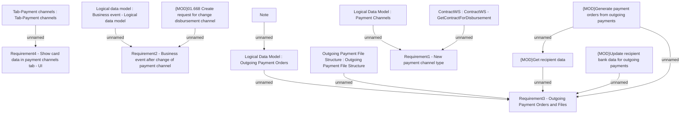

# PAYM-1097 (CBL-1093) Loan disbursement to any card

```mermaid
graph TD
    Tab_Payment_channels_Tab_Payment_channels["Tab-Payment channels : Tab-Payment channels"]
    Requirement4_Show_card_data_in_payment_channels_tab_UI["Requirement4 - Show card data in payment channels tab - UI"]
    Requirement3_Outgoing_Payment_Orders_and_Files["Requirement3 - Outgoing Payment Orders and Files"]
    Requirement2_Business_event_after_change_of_payment_channel["Requirement2 - Business event after change of payment channel"]
    el_1290711["Note"]
    Logical_Data_Model_Outgoing_Payment_Orders["Logical Data Model : Outgoing Payment Orders"]
    Outgoing_Payment_File_Structure_Outgoing_Payment_File_Struct["Outgoing Payment File Structure : Outgoing Payment File Structure"]
    Logical_data_model_Business_event_Logical_data_model["Logical data model : Business event - Logical data model"]
    MOD_01_668_Create_request_for_change_disbursement_channel["{MOD}01.668 Create request for change disbursement channel"]
    Logical_Data_Model_Payment_Channels["Logical Data Model : Payment Channels"]
    ContractWS_ContractWS_GetContractForDisbursement["ContractWS : ContractWS - GetContractForDisbursement"]
    Requirement1_New_payment_channel_type["Requirement1 - New payment channel type"]
    MOD_Update_recipient_bank_data_for_outgoing_payments["{MOD}Update recipient bank data for outgoing payments"]
    MOD_Generate_payment_orders_from_outgoing_payments["{MOD}Generate payment orders from outgoing payments"]
    MOD_Get_recipient_data["{MOD}Get recipient data"]
    Logical_Data_Model_Payment_Channels -->|unnamed| Requirement1_New_payment_channel_type
    ContractWS_ContractWS_GetContractForDisbursement -->|unnamed| Requirement1_New_payment_channel_type
    el_1290711 -->|unnamed| Logical_Data_Model_Outgoing_Payment_Orders
    Logical_data_model_Business_event_Logical_data_model -->|unnamed| Requirement2_Business_event_after_change_of_payment_channel
    Logical_Data_Model_Outgoing_Payment_Orders -->|unnamed| Requirement3_Outgoing_Payment_Orders_and_Files
    Outgoing_Payment_File_Structure_Outgoing_Payment_File_Struct -->|unnamed| Requirement3_Outgoing_Payment_Orders_and_Files
    Tab_Payment_channels_Tab_Payment_channels -->|unnamed| Requirement4_Show_card_data_in_payment_channels_tab_UI
    MOD_Get_recipient_data -->|unnamed| Requirement3_Outgoing_Payment_Orders_and_Files
    MOD_Update_recipient_bank_data_for_outgoing_payments -->|unnamed| Requirement3_Outgoing_Payment_Orders_and_Files
    MOD_Generate_payment_orders_from_outgoing_payments -->|unnamed| MOD_Get_recipient_data
    MOD_Generate_payment_orders_from_outgoing_payments -->|unnamed| Requirement3_Outgoing_Payment_Orders_and_Files
    MOD_01_668_Create_request_for_change_disbursement_channel -->|unnamed| Requirement2_Business_event_after_change_of_payment_channel
```
