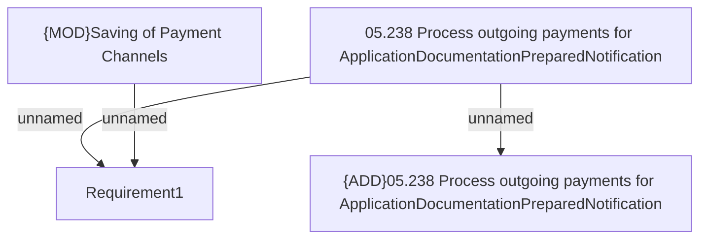

# PAYM-1148 (CBL-2946) Disburse to salesroom where materials were prepared

```mermaid
graph TD
    MOD_Saving_of_Payment_Channels["{MOD}Saving of Payment Channels"]
    n_05_238_Process_outgoing_payments_for_ApplicationDocumentat["05.238 Process outgoing payments for ApplicationDocumentationPreparedNotification"]
    ADD_05_238_Process_outgoing_payments_for_ApplicationDocument["{ADD}05.238 Process outgoing payments for ApplicationDocumentationPreparedNotification"]
    Requirement1["Requirement1"]
    n_05_238_Process_outgoing_payments_for_ApplicationDocumentat -->|unnamed| ADD_05_238_Process_outgoing_payments_for_ApplicationDocument
    n_05_238_Process_outgoing_payments_for_ApplicationDocumentat -->|unnamed| Requirement1
    MOD_Saving_of_Payment_Channels -->|unnamed| Requirement1
```
