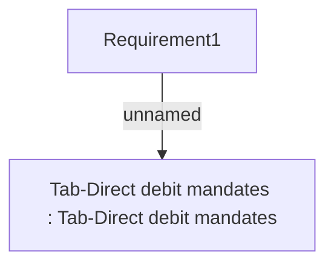

# PAYM-1151 (CBL-2946) Contracts created on Remote Salesrooms

- **Diagram Type**: Custom
- **Package**: HomerSelect/BSL/Requirements Model/In process/ISPAY/PAYM-1151 (CBL-2486) Display e-mandate document in GUI
- **Diagram ID**: 102559
- **Elements**: 2
- **Connectors**: 1

