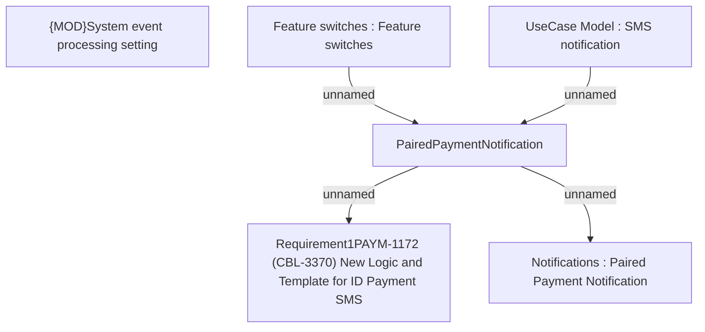

# PAYM-1172 (CBL-3370) New Logic and Template for ID Payment SMS

- **Diagram Type**: Custom
- **Package**: HomerSelect/BSL/Requirements Model/In process/ISPAY/PAYM-1172 (CBL-3370) New Logic and Template for ID Payment SMS
- **Diagram ID**: 110134
- **Elements**: 6
- **Connectors**: 4

