# PAYM-1180 (CBL-711) - Inc. pay. modularization - ANA/DEV synchro Sprint 20

- **Diagram Type**: Custom
- **Package**: HomerSelect/BSL/Requirements Model/In process/ISPAY/PAYM-1180 (CBL-711) - Inc. pay. modularization - ANA/DEV synchro Sprint 20
- **Diagram ID**: 102560
- **Elements**: 9
- **Connectors**: 0

```mermaid
graph TD
    MOD_Create_refund_item_rule["{MOD}Create refund item rule"]
    MOD_05_097_Generate_outgoing_payment_for_refund["{MOD}05.097 Generate outgoing payment for refund"]
    MOD_05_240_Cancel_outgoing_payments["{MOD}05.240 Cancel outgoing payments"]
    Show_contract_refunds_Show_contract_refunds["Show contract refunds : Show contract refunds"]
    Process_outgoing_payment_for_refunds_Process_outgoing_paymen["Process outgoing payment for refunds : Process outgoing payment for refunds"]
    General_General_Global_Parameter["General : General Global Parameter"]
    MOD_System_event_processing_setting["{MOD}System event processing setting"]
    MOD_05_310_Process_disbursement_confirmations["{MOD}05.310 Process disbursement confirmations"]
    Logical_data_model_RefundSystemEvent_schema["Logical data model : RefundSystemEvent schema"]
```

