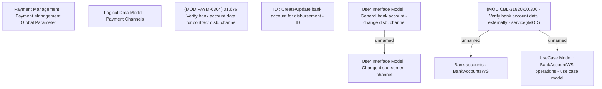

# PAYM-1214 (CBL-1767) Bank Account Verification in BSL using DOKU API (3rd Party)

- **Diagram Type**: Custom
- **Package**: HomerSelect/BSL/Requirements Model/In process/ISPAY/PAYM-1214 (CBL-1767) Bank Account Verification in BSL using DOKU API (3rd Party)
- **Diagram ID**: 106357
- **Elements**: 9
- **Connectors**: 3

