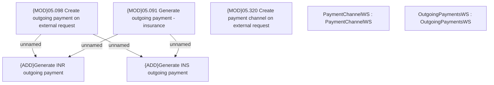

# PAYM-1290 (CBL-2620) New insurance types for REL products

- **Diagram Type**: Custom
- **Package**: HomerSelect/BSL/Requirements Model/In process/ISPAY/PAYM-1290 (CBL-2620) New insurance types for REL products
- **Diagram ID**: 104288
- **Elements**: 7
- **Connectors**: 4

