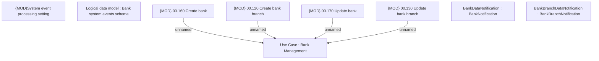

# PAYM-1309 (CBL-2794) Bank synchronization

```mermaid
graph TD
    MOD_System_event_processing_setting["{MOD}System event processing setting"]
    Logical_data_model_Bank_system_events_schema["Logical data model : Bank system events schema"]
    Use_Case_Bank_Management["Use Case : Bank Management"]
    MOD_00_170_Update_bank["{MOD} 00.170 Update bank"]
    MOD_00_130_Update_bank_branch["{MOD} 00.130 Update bank branch"]
    MOD_00_120_Create_bank_branch["{MOD} 00.120 Create bank branch"]
    MOD_00_160_Create_bank["{MOD} 00.160 Create bank"]
    BankDataNotification_BankNotification["BankDataNotification : BankNotification"]
    BankBranchDataNotification_BankBranchNotification["BankBranchDataNotification : BankBranchNotification"]
    MOD_00_160_Create_bank -->|unnamed| Use_Case_Bank_Management
    MOD_00_120_Create_bank_branch -->|unnamed| Use_Case_Bank_Management
    MOD_00_170_Update_bank -->|unnamed| Use_Case_Bank_Management
    MOD_00_130_Update_bank_branch -->|unnamed| Use_Case_Bank_Management
```
