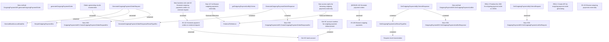

# PAYM-1347 (CBL-3618) Automate outgoing payment orders generation

```mermaid
graph TD
    New_method_OutgoingPaymentWS_generateOutgoingPaymentOrder["New method OutgoingPaymentWS.generateOutgoingPaymentOrder"]
    generateOutgoingPaymentOrder["generateOutgoingPaymentOrder"]
    SimpleOutgoingPaymentDto["SimpleOutgoingPaymentDto"]
    GeneralBankAccountDataDto["GeneralBankAccountDataDto"]
    Get_HC_bank_account["Get HC bank account"]
    GenerateOutgoingPaymentOrderResponseResultTypeDto["GenerateOutgoingPaymentOrderResponseResultTypeDto"]
    GenerateOutgoingPaymentOrderResponse["GenerateOutgoingPaymentOrderResponse"]
    GenerateOutgoingPaymentOrderRequest["GenerateOutgoingPaymentOrderRequest"]
    n_05_112_Generate_payment_orders_on_external_request["05.112 Generate payment orders on external request"]
    External_Reference["External Reference"]
    GetOutgoingPaymentsByCriteriaResponse["GetOutgoingPaymentsByCriteriaResponse"]
    GetOutgoingPaymentsByCriteriaRequest["GetOutgoingPaymentsByCriteriaRequest"]
    getOutgoingPaymentListByCriteria["getOutgoingPaymentListByCriteria"]
    External_Reference["External Reference"]
    New_access_rights_for_browsing_outgoing_payments_externally["New access rights for browsing outgoing payments externally"]
    n_05_100_Browse_outgoing_payments["05.100 Browse outgoing payments"]
    GetOutgoingPaymentListResultTypeDto["GetOutgoingPaymentListResultTypeDto"]
    New_UC_for_Browse_outgoing_payments_externally["New UC for Browse outgoing payments externally"]
    Get_HC_account_number_for_outgoing_payment_disbursement["Get HC account number for outgoing payment disbursement"]
    Orders_generating_results_enumeration["Orders generating results enumeration"]
    New_business_rule_and_UC_Generate_outgoing_payments_orders_o["New business rule and UC Generate outgoing payments orders on external request"]
    Request_result_enumeration["Request result enumeration"]
    New_XSD_OutgoingPaymentsWS_CreateOutgoingPaymentOrderRespons["New XSD OutgoingPaymentsWS.CreateOutgoingPaymentOrderResponseExt"]
    New_XSD_OutgoingPaymentsWS_CreateOutgoingPaymentOrderRequest["New XSD OutgoingPaymentsWS.CreateOutgoingPaymentOrderRequestExt"]
    New_XSD_OutgoingPaymentWS_GetOutgoingPaymentListExtResponse["New XSD OutgoingPaymentWS.GetOutgoingPaymentListExtResponse"]
    New_XSD_OutgoingPaymentWS_GetOutgoingPaymentListExtRequest["New XSD OutgoingPaymentWS.GetOutgoingPaymentListExtRequest
"]
    New_method_OutgoingPaymentWS_GetOutgoingPaymentListExt["New method OutgoingPaymentWS.GetOutgoingPaymentListExt"]
    REQ_2_Prioritize_the_JMS_for_outgoing_payment_order_on_CBSA["REQ 2 Prioritize the JMS for outgoing payment order on CBSA"]
    MOD_05_110_Generate_payment_orders["{MOD}05.110 Generate payment orders"]
    REQ_1_Create_API_for_outgoing_payment_order_generating["REQ 1 Create API for outgoing payment order generating"]
    n_05_102_Browse_outgoing_payments_externally["05.102 Browse outgoing payments externally"]
    Get_HC_account_number_for_outgoing_payment_disbursement -->|unnamed| Get_HC_bank_account
    New_business_rule_and_UC_Generate_outgoing_payments_orders_o -->|unnamed| n_05_112_Generate_payment_orders_on_external_request
    New_access_rights_for_browsing_outgoing_payments_externally -->|External Reference| External_Reference
    New_UC_for_Browse_outgoing_payments_externally -->|External Reference| External_Reference
    Orders_generating_results_enumeration -->|unnamed| GenerateOutgoingPaymentOrderResponseResultTypeDto
    MOD_05_110_Generate_payment_orders -->|unnamed| n_05_100_Browse_outgoing_payments
    n_05_112_Generate_payment_orders_on_external_request -->|unnamed| Get_HC_bank_account
    GenerateOutgoingPaymentOrderRequest -->|unnamed| New_XSD_OutgoingPaymentsWS_CreateOutgoingPaymentOrderRequest
    GenerateOutgoingPaymentOrderRequest -->|unnamed| SimpleOutgoingPaymentDto
    GenerateOutgoingPaymentOrderRequest -->|unnamed| GeneralBankAccountDataDto
    GetOutgoingPaymentsByCriteriaRequest -->|unnamed| New_XSD_OutgoingPaymentWS_GetOutgoingPaymentListExtRequest
    GenerateOutgoingPaymentOrderResponse -->|unnamed| New_XSD_OutgoingPaymentsWS_CreateOutgoingPaymentOrderRespons
    GenerateOutgoingPaymentOrderResponse -->|unnamed| GenerateOutgoingPaymentOrderResponseResultTypeDto
    GetOutgoingPaymentsByCriteriaResponse -->|unnamed| New_XSD_OutgoingPaymentWS_GetOutgoingPaymentListExtResponse
    GetOutgoingPaymentsByCriteriaResponse -->|unnamed| GetOutgoingPaymentListResultTypeDto
    GetOutgoingPaymentListResultTypeDto -->|unnamed| Request_result_enumeration
```
