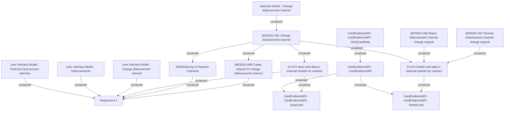

# PAYM-1365 (CBL-3841) - BSL - send request to CEV to verify card data

```mermaid
graph TD
    CardEvidenceWS_CardEvidenceWS_VerifyCardData["CardEvidenceWS : CardEvidenceWS - VerifyCardData"]
    MOD_01_667_Revoke_disbursement_channel_change_request["{MOD}01.667 Revoke disbursement channel change request"]
    MOD_01_666_Reject_disbursement_channel_change_request["{MOD}01.666 Reject disbursement channel change request"]
    MOD_01_668_Create_request_for_change_disbursement_channel["{MOD}01.668 Create request for change disbursement channel"]
    Requirment_1["Requirment 1 "]
    UseCase_Model_Change_disbursement_channel["UseCase Model : Change disbursement channel"]
    MOD_01_662_Change_disbursement_channel["{MOD}01.662 Change disbursement channel"]
    n_01_674_Delete_card_data_in_external_module_for_contract["01.674 Delete card data in external module for contract"]
    CardEvidenceWS_CardEvidenceWS_DeleteCard["CardEvidenceWS : CardEvidenceWS - DeleteCard"]
    CardEvidenceWS_CardEvidenceWS_SaveCard["CardEvidenceWS : CardEvidenceWS - SaveCard"]
    CardEvidenceWS_CardEvidenceWS["CardEvidenceWS : CardEvidenceWS"]
    n_01_673_Save_card_data_to_external_module_for_contract["01.673 Save card data to external module for contract"]
    User_Interface_Model_External_Card_account_selection["User Interface Model : External Card account selection"]
    User_Interface_Model_Disbursements["User Interface Model : Disbursements"]
    User_Interface_Model_Change_disbursement_channel["User Interface Model : Change disbursement channel"]
    MOD_Saving_of_Payment_Channels["{MOD}Saving of Payment Channels"]
    User_Interface_Model_External_Card_account_selection -->|unnamed| Requirment_1
    User_Interface_Model_Disbursements -->|unnamed| Requirment_1
    User_Interface_Model_Change_disbursement_channel -->|unnamed| Requirment_1
    CardEvidenceWS_CardEvidenceWS -->|unnamed| CardEvidenceWS_CardEvidenceWS_DeleteCard
    CardEvidenceWS_CardEvidenceWS -->|unnamed| CardEvidenceWS_CardEvidenceWS_SaveCard
    UseCase_Model_Change_disbursement_channel -->|unnamed| MOD_01_662_Change_disbursement_channel
    MOD_01_662_Change_disbursement_channel -->|unnamed| n_01_673_Save_card_data_to_external_module_for_contract
    MOD_01_662_Change_disbursement_channel -->|unnamed| MOD_Saving_of_Payment_Channels
    MOD_01_662_Change_disbursement_channel -->|unnamed| MOD_01_668_Create_request_for_change_disbursement_channel
    MOD_01_662_Change_disbursement_channel -->|unnamed| n_01_674_Delete_card_data_in_external_module_for_contract
    n_01_673_Save_card_data_to_external_module_for_contract -->|unnamed| Requirment_1
    MOD_Saving_of_Payment_Channels -->|unnamed| Requirment_1
    MOD_01_666_Reject_disbursement_channel_change_request -->|unnamed| n_01_674_Delete_card_data_in_external_module_for_contract
    MOD_01_667_Revoke_disbursement_channel_change_request -->|unnamed| n_01_674_Delete_card_data_in_external_module_for_contract
    MOD_01_668_Create_request_for_change_disbursement_channel -->|unnamed| Requirment_1
    CardEvidenceWS_CardEvidenceWS_VerifyCardData -->|unnamed| CardEvidenceWS_CardEvidenceWS
    n_01_674_Delete_card_data_in_external_module_for_contract -->|unnamed| CardEvidenceWS_CardEvidenceWS_DeleteCard
    n_01_673_Save_card_data_to_external_module_for_contract -->|unnamed| CardEvidenceWS_CardEvidenceWS_SaveCard
```
