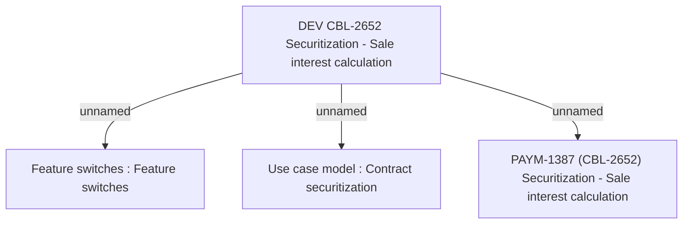

# PAYM-1387 (CBL-2652) Securitization - Sale interest calculation

- **Diagram Type**: Custom
- **Package**: HomerSelect/BSL/Requirements Model/In process/ISPAY/PAYM-1387 (CBL-2652) Securitization - Sale interest calculation
- **Diagram ID**: 113133
- **Elements**: 4
- **Connectors**: 3

