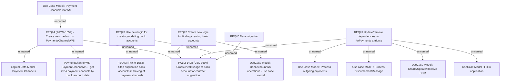

# PAYM-1428 (CBL-3607) Cross check usage of bank account for contract origination

```mermaid
graph TD
    Logical_Data_Model_Payment_Channels["Logical Data Model : Payment Channels"]
    Use_Case_Model_Payment_Channels_via_WS["Use Case Model : Payment Channels via WS"]
    PaymentChannelWS_PaymentChannelWS_get_GBA_payment_channels_b["PaymentChannelWS : PaymentChannelWS - get GBA payment channels by bank account data"]
    REQ_3_PAYM_1552_Stop_duplication_bank_accounts_in_Saving_of_["REQ#3 (PAYM-1552) - Stop duplication bank accounts in Saving of payment channels"]
    REQ_5_Data_migration["REQ#5 Data migration"]
    REQ_4_PAYM_1552_Create_new_method_on_PaymentsChannelsWS["REQ#4 (PAYM-1552) - Create new method on PaymentsChannelsWS "]
    REQ_3_Use_new_logic_for_creating_updating_bank_accounts["REQ#3 Use new logic for creating/updating bank accounts"]
    UseCase_Model_BankAccountWS_operations_use_case_model["UseCase Model : BankAccountWS operations - use case model"]
    REQ_2_Create_new_logic_for_finding_creating_bank_accounts["REQ#2 Create new logic for finding/creating bank accounts"]
    Use_Case_Model_Process_outgoing_payments["Use Case Model : Process outgoing payments"]
    Use_case_Model_Process_DisbursementMessage["Use case Model : Process DisbursementMessage"]
    UseCase_Model_Create_Update_Receive_DDM["UseCase Model : Create/Update/Receive DDM"]
    UseCase_Model_Fill_in_application["UseCase Model : Fill in application"]
    REQ_1_Update_remove_dependencies_on_forPayments_attribute["REQ#1 Update/remove dependencies on forPayments attribute"]
    PAYM_1428_CBL_3607_Cross_check_usage_of_bank_account_for_con["PAYM-1428 (CBL-3607) Cross check usage of bank account for contract origination"]
    REQ_4_PAYM_1552_Create_new_method_on_PaymentsChannelsWS -->|unnamed| PAYM_1428_CBL_3607_Cross_check_usage_of_bank_account_for_con
    REQ_2_Create_new_logic_for_finding_creating_bank_accounts -->|unnamed| PAYM_1428_CBL_3607_Cross_check_usage_of_bank_account_for_con
    REQ_1_Update_remove_dependencies_on_forPayments_attribute -->|unnamed| PAYM_1428_CBL_3607_Cross_check_usage_of_bank_account_for_con
    REQ_3_Use_new_logic_for_creating_updating_bank_accounts -->|unnamed| PAYM_1428_CBL_3607_Cross_check_usage_of_bank_account_for_con
    REQ_5_Data_migration -->|unnamed| PAYM_1428_CBL_3607_Cross_check_usage_of_bank_account_for_con
    REQ_1_Update_remove_dependencies_on_forPayments_attribute -->|unnamed| UseCase_Model_Fill_in_application
    REQ_1_Update_remove_dependencies_on_forPayments_attribute -->|unnamed| UseCase_Model_Create_Update_Receive_DDM
    REQ_1_Update_remove_dependencies_on_forPayments_attribute -->|unnamed| Use_case_Model_Process_DisbursementMessage
    REQ_1_Update_remove_dependencies_on_forPayments_attribute -->|unnamed| Use_Case_Model_Process_outgoing_payments
    REQ_2_Create_new_logic_for_finding_creating_bank_accounts -->|unnamed| UseCase_Model_BankAccountWS_operations_use_case_model
    Use_Case_Model_Payment_Channels_via_WS -->|unnamed| REQ_4_PAYM_1552_Create_new_method_on_PaymentsChannelsWS
    REQ_3_Use_new_logic_for_creating_updating_bank_accounts -->|unnamed| REQ_3_PAYM_1552_Stop_duplication_bank_accounts_in_Saving_of_
    REQ_4_PAYM_1552_Create_new_method_on_PaymentsChannelsWS -->|unnamed| PaymentChannelWS_PaymentChannelWS_get_GBA_payment_channels_b
    REQ_4_PAYM_1552_Create_new_method_on_PaymentsChannelsWS -->|unnamed| Logical_Data_Model_Payment_Channels
```
