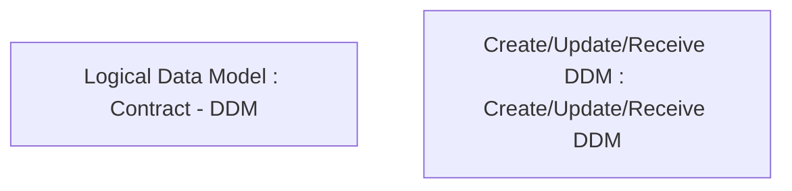

# PAYM-1446 (CBL-3619) PH - Direct Debit for Cards - removal of Fixed Payment option

- **Diagram Type**: Custom
- **Package**: HomerSelect/BSL/Requirements Model/In process/ISPAY/PAYM-1446 (CBL-3619) PH - Direct Debit for Cards - removal of Fixed Payment option
- **Diagram ID**: 108461
- **Elements**: 2
- **Connectors**: 0

