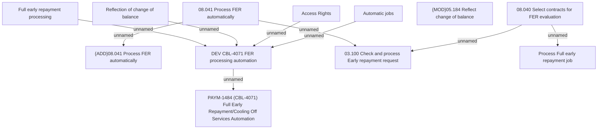

# PAYM-1484 (CBL-4071) Full Early Repayment/Cooling Off Services Automation

```mermaid
graph TD
    ADD_08_041_Process_FER_automatically["{ADD}08.041 Process FER automatically"]
    n_08_041_Process_FER_automatically["08.041 Process FER automatically"]
    Automatic_jobs["Automatic jobs"]
    Access_Rights["Access Rights"]
    Full_early_repayment_processing["Full early repayment processing"]
    Reflection_of_change_of_balance["Reflection of change of balance"]
    DEV_CBL_4071_FER_processing_automation["DEV CBL-4071 FER processing automation"]
    PAYM_1484_CBL_4071_Full_Early_Repayment_Cooling_Off_Services["PAYM-1484 (CBL-4071) Full Early Repayment/Cooling Off Services Automation"]
    MOD_05_184_Reflect_change_of_balance["{MOD}05.184 Reflect change of balance"]
    n_03_100_Check_and_process_Early_repayment_request["03.100 Check and process Early repayment request"]
    Process_Full_early_repayment_job["Process Full early repayment job"]
    n_08_040_Select_contracts_for_FER_evaluation["08.040 Select contracts for FER evaluation"]
    DEV_CBL_4071_FER_processing_automation -->|unnamed| PAYM_1484_CBL_4071_Full_Early_Repayment_Cooling_Off_Services
    Full_early_repayment_processing -->|unnamed| DEV_CBL_4071_FER_processing_automation
    Reflection_of_change_of_balance -->|unnamed| DEV_CBL_4071_FER_processing_automation
    Access_Rights -->|unnamed| DEV_CBL_4071_FER_processing_automation
    Automatic_jobs -->|unnamed| DEV_CBL_4071_FER_processing_automation
    n_08_041_Process_FER_automatically -->|unnamed| ADD_08_041_Process_FER_automatically
    n_08_041_Process_FER_automatically -->|unnamed| n_03_100_Check_and_process_Early_repayment_request
    n_08_040_Select_contracts_for_FER_evaluation -->|unnamed| n_03_100_Check_and_process_Early_repayment_request
    n_08_040_Select_contracts_for_FER_evaluation -->|unnamed| Process_Full_early_repayment_job
```
