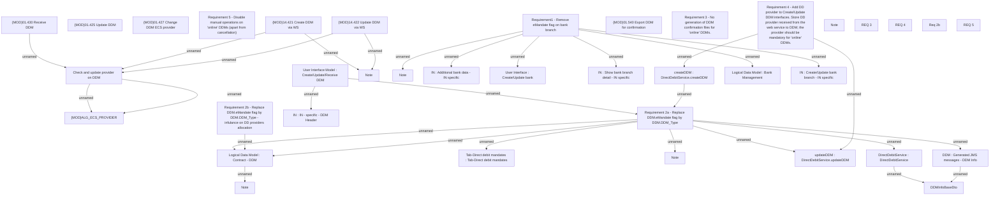

# PAYM-1487 (CBL-3093) Standing Instruction method of DDM

```mermaid
graph TD
    Logical_Data_Model_Contract_DDM["Logical Data Model : Contract - DDM"]
    MOD_01_430_Receive_DDM["{MOD}01.430 Receive DDM"]
    MOD_01_425_Update_DDM["{MOD}01.425 Update DDM"]
    MOD_01_427_Change_DDM_ECS_provider["{MOD}01.427 Change DDM ECS provider"]
    Requirement_5_Disable_manual_operations_on_online_DDMs_apart["Requirement 5 - Disable manual operations on 'online' DDMs (apart from cancellation)"]
    MOD_ALG_ECS_PROVIDER["{MOD}ALG_ECS_PROVIDER"]
    Check_and_update_provider_on_DDM["Check and update provider on DDM"]
    Requirement_2b_Replace_DDM_eMandate_flag_by_DDM_DDM_Type_inf["Requirement 2b - Replace DDM.eMandate flag by DDM.DDM_Type - infulance on DD providers allocation"]
    el_1710252["Note"]
    IN_IN_specific_DDM_Header["IN : IN - specific - DDM Header"]
    User_Interface_Model_Create_Update_Receive_DDM["User Interface Model : Create/Update/Receive DDM"]
    Tab_Direct_debit_mandates_Tab_Direct_debit_mandates["Tab-Direct debit mandates : Tab-Direct debit mandates"]
    el_1710244["Note"]
    el_1710242["Note"]
    el_1710237["Note"]
    IN_Additional_bank_data_IN_specific["IN : Additional bank data - IN specific"]
    User_Interface_Create_Update_bank["User Interface : Create/Update bank"]
    IN_Show_bank_branch_detail_IN_specific["IN : Show bank branch detail - IN specific"]
    updateDDM_DirectDebitService_updateDDM["updateDDM : DirectDebitService.updateDDM"]
    createDDM_DirectDebitService_createDDM["createDDM : DirectDebitService.createDDM"]
    DDMInfoBaseDto["DDMInfoBaseDto"]
    DirectDebitService_DirectDebitService["DirectDebitService : DirectDebitService"]
    DDM_Generated_JMS_messages_DDM_Info["DDM : Generated JMS messages - DDM Info"]
    MOD_14_421_Create_DDM_via_WS["{MOD}14.421 Create DDM via WS"]
    MOD_14_422_Update_DDM_via_WS["{MOD}14.422 Update DDM via WS"]
    Requirement_4_Add_DD_provider_to_Create_Update_DDM_interface["Requirement 4 - Add DD provider to Create/Update DDM interfaces. Store DD provider received from the web service to DDM; the provider should be mandatory for 'online' DDMs. "]
    MOD_01_540_Export_DDM_for_confirmation["{MOD}01.540 Export DDM for confirmation"]
    Requirement_3_No_generation_of_DDM_confirmation_files_for_on["Requirement 3 - No generation of DDM confirmation files for 'online' DDMs."]
    Logical_Data_Model_Contract_DDM["Logical Data Model : Contract - DDM"]
    Requirement_2a_Replace_DDM_eMandate_flag_by_DDM_DDM_Type["Requirement 2a - Replace DDM.eMandate flag by DDM.DDM_Type"]
    Logical_Data_Model_Bank_Management["Logical Data Model : Bank Management"]
    Requirement1_Remove_eMandate_flag_on_bank_branch["Requirement1 - Remove eMandate flag on bank branch"]
    IN_Create_Update_bank_branch_IN_specific["IN : Create/Update bank branch - IN specific"]
    el_1710246["Note"]
    REQ_3["REQ 3"]
    REQ_4["REQ 4"]
    Req_2b["Req 2b"]
    REQ_5["REQ 5"]
    Requirement1_Remove_eMandate_flag_on_bank_branch -->|unnamed| IN_Additional_bank_data_IN_specific
    Requirement_2a_Replace_DDM_eMandate_flag_by_DDM_DDM_Type -->|unnamed| Logical_Data_Model_Contract_DDM
    Logical_Data_Model_Contract_DDM -->|unnamed| el_1710252
    User_Interface_Model_Create_Update_Receive_DDM -->|unnamed| IN_IN_specific_DDM_Header
    Requirement_2a_Replace_DDM_eMandate_flag_by_DDM_DDM_Type -->|unnamed| Tab_Direct_debit_mandates_Tab_Direct_debit_mandates
    Requirement_2a_Replace_DDM_eMandate_flag_by_DDM_DDM_Type -->|unnamed| el_1710244
    Requirement_2b_Replace_DDM_eMandate_flag_by_DDM_DDM_Type_inf -->|unnamed| Logical_Data_Model_Contract_DDM
    Requirement1_Remove_eMandate_flag_on_bank_branch -->|unnamed| el_1710237
    Requirement1_Remove_eMandate_flag_on_bank_branch -->|unnamed| IN_Create_Update_bank_branch_IN_specific
    Requirement1_Remove_eMandate_flag_on_bank_branch -->|unnamed| User_Interface_Create_Update_bank
    Requirement1_Remove_eMandate_flag_on_bank_branch -->|unnamed| IN_Show_bank_branch_detail_IN_specific
    Requirement_4_Add_DD_provider_to_Create_Update_DDM_interface -->|unnamed| updateDDM_DirectDebitService_updateDDM
    Requirement_2a_Replace_DDM_eMandate_flag_by_DDM_DDM_Type -->|unnamed| updateDDM_DirectDebitService_updateDDM
    Requirement_4_Add_DD_provider_to_Create_Update_DDM_interface -->|unnamed| createDDM_DirectDebitService_createDDM
    DDM_Generated_JMS_messages_DDM_Info -->|unnamed| DDMInfoBaseDto
    DirectDebitService_DirectDebitService -->|unnamed| DDMInfoBaseDto
    Requirement_2a_Replace_DDM_eMandate_flag_by_DDM_DDM_Type -->|unnamed| DirectDebitService_DirectDebitService
    Requirement_2a_Replace_DDM_eMandate_flag_by_DDM_DDM_Type -->|unnamed| DDM_Generated_JMS_messages_DDM_Info
    Requirement_2a_Replace_DDM_eMandate_flag_by_DDM_DDM_Type -->|unnamed| Logical_Data_Model_Contract_DDM
    createDDM_DirectDebitService_createDDM -->|unnamed| Requirement_2a_Replace_DDM_eMandate_flag_by_DDM_DDM_Type
    User_Interface_Model_Create_Update_Receive_DDM -->|unnamed| Requirement_2a_Replace_DDM_eMandate_flag_by_DDM_DDM_Type
    Requirement1_Remove_eMandate_flag_on_bank_branch -->|unnamed| Logical_Data_Model_Bank_Management
    Check_and_update_provider_on_DDM -->|unnamed| MOD_ALG_ECS_PROVIDER
    Check_and_update_provider_on_DDM -->|unnamed| MOD_ALG_ECS_PROVIDER
    MOD_14_422_Update_DDM_via_WS -->|unnamed| Check_and_update_provider_on_DDM
    MOD_14_421_Create_DDM_via_WS -->|unnamed| Check_and_update_provider_on_DDM
    MOD_01_430_Receive_DDM -->|unnamed| Check_and_update_provider_on_DDM
    MOD_14_422_Update_DDM_via_WS -->|unnamed| el_1710242
    MOD_14_421_Create_DDM_via_WS -->|unnamed| el_1710242
```
