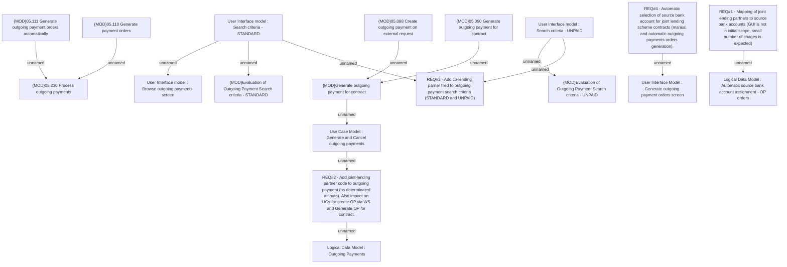

# PAYM-1488 (CBL-3570) - Joint lending support in Outgoing payments

```mermaid
graph TD
    MOD_05_230_Process_outgoing_payments["{MOD}05.230 Process outgoing payments"]
    MOD_05_111_Generate_outgoing_payment_orders_automatically["{MOD}05.111 Generate outgoing payment orders automatically"]
    MOD_05_110_Generate_payment_orders["{MOD}05.110 Generate payment orders"]
    User_Interface_model_Search_criteria_UNPAID["User Interface model : Search criteria - UNPAID"]
    User_Interface_model_Browse_outgoing_payments_screen["User Interface model : Browse outgoing payments screen"]
    User_Interface_model_Search_criteria_STANDARD["User Interface model : Search criteria - STANDARD"]
    MOD_Evaluation_of_Outgoing_Payment_Search_criteria_UNPAID["{MOD}Evaluation of Outgoing Payment Search criteria - UNPAID"]
    MOD_Evaluation_of_Outgoing_Payment_Search_criteria_STANDARD["{MOD}Evaluation of Outgoing Payment Search criteria - STANDARD"]
    MOD_05_098_Create_outgoing_payment_on_external_request["{MOD}05.098 Create outgoing payment on external request"]
    MOD_Generate_outgoing_payment_for_contract["{MOD}Generate outgoing payment for contract"]
    User_Interface_Model_Generate_outgoing_payment_orders_screen["User Interface Model : Generate outgoing payment orders screen"]
    Use_Case_Model_Generate_and_Cancel_outgoing_payments["Use Case Model : Generate and Cancel outgoing payments"]
    MOD_05_090_Generate_outgoing_payment_for_contract["{MOD}05.090 Generate outgoing payment for contract"]
    Logical_Data_Model_Outgoing_Payments["Logical Data Model : Outgoing Payments"]
    REQ_3_Add_co_lending_parner_filed_to_outgoing_payment_search["REQ#3 - Add co-lending parner filed to outgoing payment search criteria (STANDARD and UNPAID) "]
    REQ_2_Add_joint_lending_partner_code_to_outgoing_payment_as_["REQ#2 - Add joint-lending partner code to outgoing payment (as determinated attibute). Also impact on UCs for create OP via WS and Generate OP for contract. "]
    Logical_Data_Model_Automatic_source_bank_account_assignment_["Logical Data Model : Automatic source bank account assignment - OP orders"]
    REQ_4_Automatic_selection_of_source_bank_account_for_joint_l["REQ#4 - Automatic selection of source bank account for joint lending scheme contracts (manual and automatic outgoing payments orders generation). "]
    REQ_1_Mapping_of_joint_lending_partners_to_source_bank_accou["REQ#1 - Mapping of joint lending partners to source bank accounts (GUI is not in initial scope, small number of chages is expected)"]
    User_Interface_model_Search_criteria_UNPAID -->|unnamed| REQ_3_Add_co_lending_parner_filed_to_outgoing_payment_search
    User_Interface_model_Search_criteria_UNPAID -->|unnamed| MOD_Evaluation_of_Outgoing_Payment_Search_criteria_UNPAID
    User_Interface_model_Search_criteria_STANDARD -->|unnamed| REQ_3_Add_co_lending_parner_filed_to_outgoing_payment_search
    User_Interface_model_Search_criteria_STANDARD -->|unnamed| MOD_Evaluation_of_Outgoing_Payment_Search_criteria_STANDARD
    User_Interface_model_Search_criteria_STANDARD -->|unnamed| User_Interface_model_Browse_outgoing_payments_screen
    Use_Case_Model_Generate_and_Cancel_outgoing_payments -->|unnamed| REQ_2_Add_joint_lending_partner_code_to_outgoing_payment_as_
    REQ_2_Add_joint_lending_partner_code_to_outgoing_payment_as_ -->|unnamed| Logical_Data_Model_Outgoing_Payments
    REQ_4_Automatic_selection_of_source_bank_account_for_joint_l -->|unnamed| User_Interface_Model_Generate_outgoing_payment_orders_screen
    REQ_1_Mapping_of_joint_lending_partners_to_source_bank_accou -->|unnamed| Logical_Data_Model_Automatic_source_bank_account_assignment_
    MOD_05_110_Generate_payment_orders -->|unnamed| MOD_05_230_Process_outgoing_payments
    MOD_05_111_Generate_outgoing_payment_orders_automatically -->|unnamed| MOD_05_230_Process_outgoing_payments
    MOD_05_090_Generate_outgoing_payment_for_contract -->|unnamed| MOD_Generate_outgoing_payment_for_contract
    MOD_05_098_Create_outgoing_payment_on_external_request -->|unnamed| MOD_Generate_outgoing_payment_for_contract
    MOD_Generate_outgoing_payment_for_contract -->|unnamed| Use_Case_Model_Generate_and_Cancel_outgoing_payments
```
