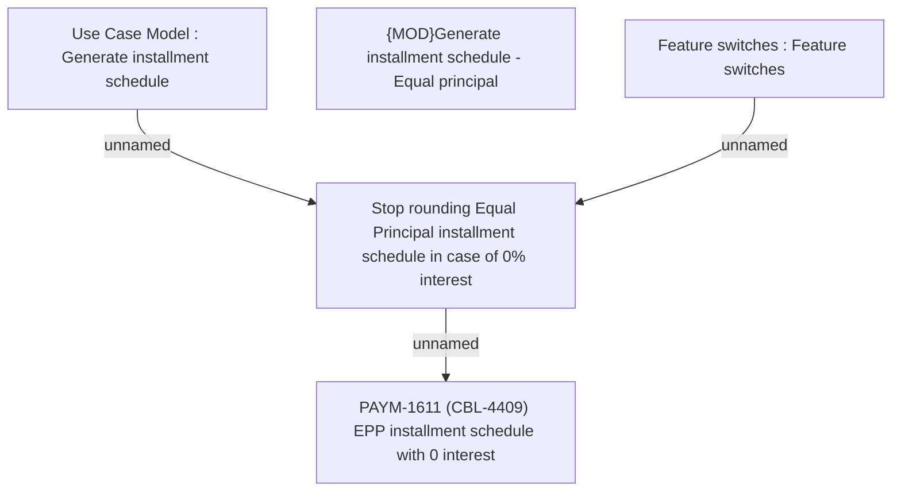

# PAYM-1611 (CBL-4409) EPP installment schedule with 0 interest

- **Diagram Type**: Custom
- **Package**: HomerSelect/BSL/Requirements Model/In process/ISPAY/PAYM-1611 (CBL-4409) EPP installment schedule with 0 interest
- **Diagram ID**: 110128
- **Elements**: 5
- **Connectors**: 3

