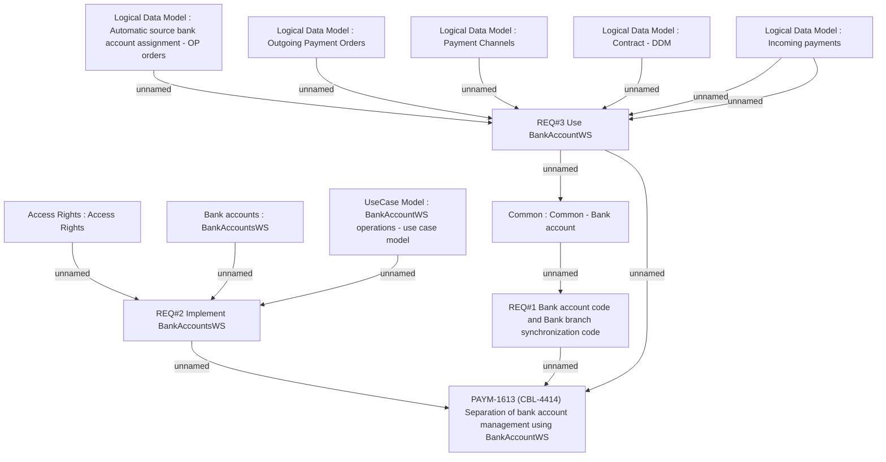

# PAYM-1613 (CBL-4414) Separation of bank account management using BankAccountWS

```mermaid
graph TD
    Logical_Data_Model_Automatic_source_bank_account_assignment_["Logical Data Model : Automatic source bank account assignment - OP orders"]
    Logical_Data_Model_Outgoing_Payment_Orders["Logical Data Model : Outgoing Payment Orders"]
    Logical_Data_Model_Payment_Channels["Logical Data Model : Payment Channels"]
    Logical_Data_Model_Contract_DDM["Logical Data Model : Contract - DDM"]
    Logical_Data_Model_Incoming_payments["Logical Data Model : Incoming payments"]
    Logical_Data_Model_Incoming_payments["Logical Data Model : Incoming payments"]
    Access_Rights_Access_Rights["Access Rights : Access Rights"]
    Common_Common_Bank_account["Common : Common - Bank account"]
    Common_Common_Bank_account["Common : Common - Bank account"]
    Bank_accounts_BankAccountsWS["Bank accounts : BankAccountsWS"]
    UseCase_Model_BankAccountWS_operations_use_case_model["UseCase Model : BankAccountWS operations - use case model"]
    REQ_2_Implement_BankAccountsWS["REQ#2 Implement BankAccountsWS"]
    REQ_1_Bank_account_code_and_Bank_branch_synchronization_code["REQ#1 Bank account code and Bank branch synchronization code"]
    REQ_3_Use_BankAccountWS["REQ#3 Use BankAccountWS"]
    PAYM_1613_CBL_4414_Separation_of_bank_account_management_usi["PAYM-1613 (CBL-4414) Separation of bank account management using BankAccountWS"]
    Logical_Data_Model_Automatic_source_bank_account_assignment_ -->|unnamed| REQ_3_Use_BankAccountWS
    Logical_Data_Model_Outgoing_Payment_Orders -->|unnamed| REQ_3_Use_BankAccountWS
    Logical_Data_Model_Payment_Channels -->|unnamed| REQ_3_Use_BankAccountWS
    Logical_Data_Model_Contract_DDM -->|unnamed| REQ_3_Use_BankAccountWS
    Logical_Data_Model_Incoming_payments -->|unnamed| REQ_3_Use_BankAccountWS
    Logical_Data_Model_Incoming_payments -->|unnamed| REQ_3_Use_BankAccountWS
    Access_Rights_Access_Rights -->|unnamed| REQ_2_Implement_BankAccountsWS
    Common_Common_Bank_account -->|unnamed| REQ_1_Bank_account_code_and_Bank_branch_synchronization_code
    Bank_accounts_BankAccountsWS -->|unnamed| REQ_2_Implement_BankAccountsWS
    UseCase_Model_BankAccountWS_operations_use_case_model -->|unnamed| REQ_2_Implement_BankAccountsWS
    REQ_2_Implement_BankAccountsWS -->|unnamed| PAYM_1613_CBL_4414_Separation_of_bank_account_management_usi
    REQ_1_Bank_account_code_and_Bank_branch_synchronization_code -->|unnamed| PAYM_1613_CBL_4414_Separation_of_bank_account_management_usi
    REQ_3_Use_BankAccountWS -->|unnamed| PAYM_1613_CBL_4414_Separation_of_bank_account_management_usi
    REQ_3_Use_BankAccountWS -->|unnamed| Common_Common_Bank_account
```
