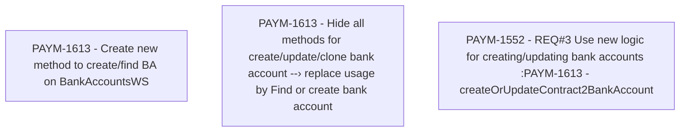

# PAYM-1613 - Use new logic for creating/updating bank accounts

```mermaid
graph TD
    PAYM_1613_Create_new_method_to_create_find_BA_on_BankAccount["PAYM-1613 - Create new method to create/find BA on BankAccountsWS"]
    PAYM_1613_Hide_all_methods_for_create_update_clone_bank_acco["PAYM-1613 - Hide all methods for create/update/clone bank account --› replace usage by Find or create bank account"]
    PAYM_1552_REQ_3_Use_new_logic_for_creating_updating_bank_acc["PAYM-1552 - REQ#3 Use new logic for creating/updating bank accounts :PAYM-1613 - other methods"]
    PAYM_1552_REQ_3_Use_new_logic_for_creating_updating_bank_acc["PAYM-1552 - REQ#3 Use new logic for creating/updating bank accounts :PAYM-1613 - savingOfPaymentChannels"]
    PAYM_1552_REQ_3_Use_new_logic_for_creating_updating_bank_acc["PAYM-1552 - REQ#3 Use new logic for creating/updating bank accounts :PAYM-1613 - updateContractFromTemporaryApplication"]
    PAYM_1552_REQ_3_Use_new_logic_for_creating_updating_bank_acc["PAYM-1552 - REQ#3 Use new logic for creating/updating bank accounts :PAYM-1613 - createOrUpdateContract2BankAccount"]
```
