# PAYM-1613 - createOrUpdateContract2BankAccount

- **Diagram Type**: Custom
- **Package**: HomerSelect/BSL/Requirements Model/In process/ISPAY/PAYM-1613 - (CBL-4414) - Separation of bank account management using BankAccountWS
- **Diagram ID**: 108464
- **Elements**: 9
- **Connectors**: 3

```mermaid
graph TD
    DEL_01_098_Update_application_v8["{DEL}01.098 Update application v8"]
    MOD_01_098_Update_and_evaluate_application_v9["{MOD}01.098 Update and evaluate application v9"]
    n_01_083_Fill_in_application_2BoD["01.083 Fill in application - 2BoD"]
    MOD_01_082_Fill_in_application_1BoD["{MOD}01.082 Fill in application - 1BoD"]
    n_01_080_Fill_in_application["01.080 Fill in application"]
    MOD_01_081_Fill_in_application_1SP["{MOD}01.081 Fill in application - 1SP"]
    n_01_095_Create_and_evaluate_application["01.095 Create and evaluate application"]
    n_01_640_Edit_delinquency_direct_debit["01.640 Edit delinquency direct debit"]
    createOrUpdateContract2BankAccount["createOrUpdateContract2BankAccount"]
    MOD_01_081_Fill_in_application_1SP -->|unnamed| n_01_080_Fill_in_application
    n_01_083_Fill_in_application_2BoD -->|unnamed| n_01_080_Fill_in_application
    MOD_01_082_Fill_in_application_1BoD -->|unnamed| n_01_080_Fill_in_application
```

