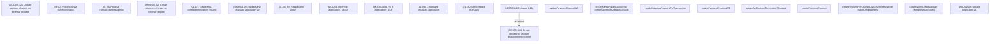

# PAYM-1613 - other methods

```mermaid
graph TD
    MOD_05_321_Update_payment_channel_on_external_request["{MOD}05.321 Update payment channel on external request"]
    n_09_901_Process_SNM_synchronization["09.901 Process SNM synchronization"]
    n_05_700_Process_TransactionMessageDto["05.700 Process TransactionMessageDto "]
    MOD_05_320_Create_payment_channel_on_external_request["{MOD}05.320 Create payment channel on external request"]
    n_01_171_Create_REL_contract_termination_request["01.171 Create REL contract termination request"]
    MOD_01_098_Update_and_evaluate_application_v9["{MOD}01.098 Update and evaluate application v9"]
    n_01_083_Fill_in_application_2BoD["01.083 Fill in application - 2BoD"]
    MOD_01_082_Fill_in_application_1BoD["{MOD}01.082 Fill in application - 1BoD"]
    MOD_01_081_Fill_in_application_1SP["{MOD}01.081 Fill in application - 1SP"]
    n_01_095_Create_and_evaluate_application["01.095 Create and evaluate application"]
    n_01_180_Sign_contract_manually["01.180 Sign contract manually"]
    MOD_01_668_Create_request_for_change_disbursement_channel["{MOD}01.668 Create request for change disbursement channel"]
    MOD_01_425_Update_DDM["{MOD}01.425 Update DDM"]
    updatePaymentChannelWS["updatePaymentChannelWS"]
    createPartner2BankAccounts_createSalesroom2BankAccounts["createPartner2BankAccounts / createSalesroom2BankAccounts"]
    createOutgoingPaymentForTransaction["createOutgoingPaymentForTransaction"]
    createPaymentChannelWS["createPaymentChannelWS"]
    createRelContractTerminationRequest["createRelContractTerminationRequest"]
    createPaymentChannel["createPaymentChannel"]
    createRequestForChangeDisbursementChannel_SaveOrUpdate_BA["createRequestForChangeDisbursementChannel (SaveOrUpdate BA)"]
    updateDirectDebitMandate_MergeBankAccount["updateDirectDebitMandate (MergeBankAccount)"]
    DEL_01_098_Update_application_v8["{DEL}01.098 Update application v8"]
    MOD_01_425_Update_DDM -->|unnamed| MOD_01_668_Create_request_for_change_disbursement_channel
```
