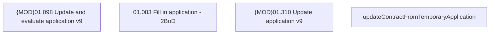

# PAYM-1613 - updateContractFromTemporaryApplication

```mermaid
graph TD
    MOD_01_098_Update_and_evaluate_application_v9["{MOD}01.098 Update and evaluate application v9"]
    n_01_083_Fill_in_application_2BoD["01.083 Fill in application - 2BoD"]
    MOD_01_310_Update_application_v9["{MOD}01.310 Update application v9"]
    updateContractFromTemporaryApplication["updateContractFromTemporaryApplication"]
```
