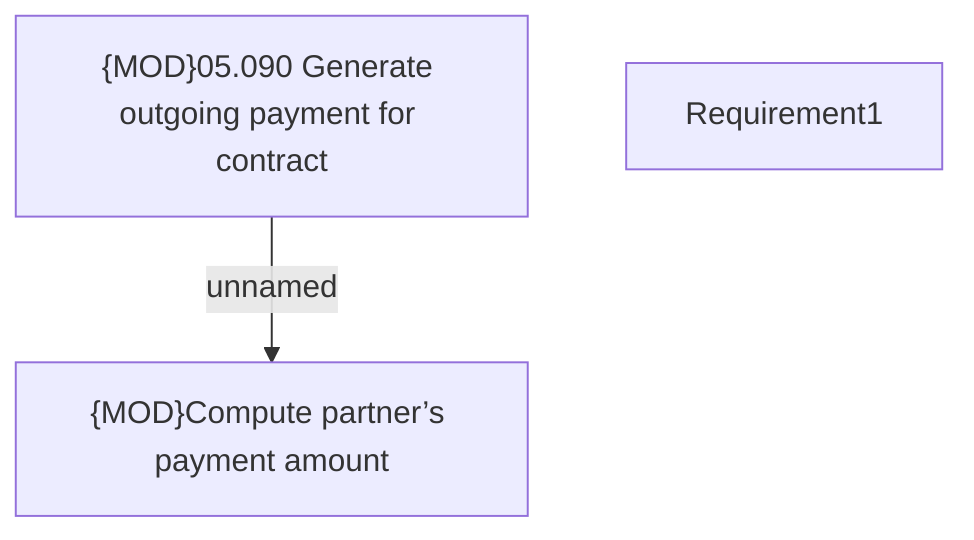

# PAYM-1625 (CBL-4117) Outgoing Payment Disbursement for Telco Partners 

- **Diagram Type**: Custom
- **Package**: HomerSelect/BSL/Requirements Model/In process/ISPAY/PAYM-1625 (CBL-4117) Outgoing Payment Disbursement for Telco Partners 
- **Diagram ID**: 108943
- **Elements**: 3
- **Connectors**: 1

