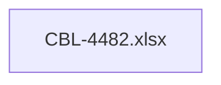

# PAYM-1640 (CBL-4482) - Monitor system events - analysis - PHASE 1

- **Diagram Type**: Custom
- **Package**: HomerSelect/BSL/Requirements Model/In process/ISPAY/PAYM-1640 (CBL-4482) - Monitor system events - analysis - PHASE 1
- **Diagram ID**: 110764
- **Elements**: 1
- **Connectors**: 0

