# PAYM-1677 (CBL-4161) Add co-lending partner information in DDM and DDS export

- **Diagram Type**: Custom
- **Package**: HomerSelect/BSL/Requirements Model/In process/ISPAY/PAYM-1677 (CBL-4161) Add co-lending partner information in DDM and DDS export
- **Diagram ID**: 109346
- **Elements**: 14
- **Connectors**: 10

```mermaid
graph TD
    UseCase_model_Process_internal_system_events_and_notificatio["UseCase model : Process internal system events and notifications for DDMs"]
    Logical_Data_Model_Contract_DDM["Logical Data Model : Contract - DDM"]
    getDDMInfo_DirectDebitService_getDDMByCUID["getDDMInfo :DirectDebitService.getDDMByCUID"]
    getDDMByCode_DirectDebitService_getDDMByCode["getDDMByCode : DirectDebitService.getDDMByCode"]
    getDDMByContract_DirectDebitService_getDDMByContract["getDDMByContract : DirectDebitService.getDDMByContract"]
    UseCase_Model_Create_Update_Receive_DDM["UseCase Model : Create/Update/Receive DDM"]
    OutgoingDirectDebitMandates_OutgoingDirectDebitMandates["OutgoingDirectDebitMandates : OutgoingDirectDebitMandates"]
    DDS_Confirmation_DDS_Confirmation["DDS_Confirmation : DDS_Confirmation"]
    DDM_Generated_JMS_messages_DDM_Info["DDM : Generated JMS messages - DDM Info"]
    createDDM_DirectDebitService_createDDM["createDDM : DirectDebitService.createDDM"]
    Requirement3_Add_JFS_partner_codes_into_DDM_DDS_export_files["Requirement3 - Add JFS partner codes into DDM/DDS export files"]
    Requirement1_Store_JSF_partner_codes_on_DDM_during_contract_["Requirement1 - Store JSF partner codes on DDM during contract signature and after contract signature"]
    Requirement2_Add_JFS_partner_code_on_DDM_via_WS_and_JMS["Requirement2 - Add JFS partner code on DDM via WS and JMS"]
    el_1327914["Note"]
    Requirement1_Store_JSF_partner_codes_on_DDM_during_contract_ -->|unnamed| UseCase_model_Process_internal_system_events_and_notificatio
    Requirement2_Add_JFS_partner_code_on_DDM_via_WS_and_JMS -->|unnamed| getDDMInfo_DirectDebitService_getDDMByCUID
    Requirement2_Add_JFS_partner_code_on_DDM_via_WS_and_JMS -->|unnamed| getDDMByCode_DirectDebitService_getDDMByCode
    Requirement2_Add_JFS_partner_code_on_DDM_via_WS_and_JMS -->|unnamed| getDDMByContract_DirectDebitService_getDDMByContract
    Requirement1_Store_JSF_partner_codes_on_DDM_during_contract_ -->|unnamed| UseCase_Model_Create_Update_Receive_DDM
    Requirement3_Add_JFS_partner_codes_into_DDM_DDS_export_files -->|unnamed| OutgoingDirectDebitMandates_OutgoingDirectDebitMandates
    Requirement3_Add_JFS_partner_codes_into_DDM_DDS_export_files -->|unnamed| DDS_Confirmation_DDS_Confirmation
    Requirement2_Add_JFS_partner_code_on_DDM_via_WS_and_JMS -->|unnamed| DDM_Generated_JMS_messages_DDM_Info
    Requirement2_Add_JFS_partner_code_on_DDM_via_WS_and_JMS -->|unnamed| createDDM_DirectDebitService_createDDM
    Logical_Data_Model_Contract_DDM -->|unnamed| Requirement1_Store_JSF_partner_codes_on_DDM_during_contract_
```

