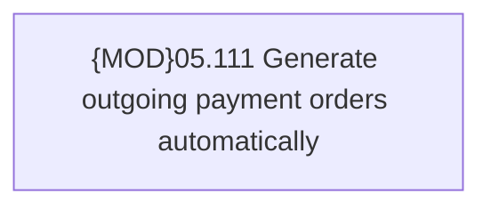

# PAYM-1721 (CBL-4621) Automatic outgoing payment disbursement for joint lending contracts

- **Diagram Type**: Custom
- **Package**: HomerSelect/BSL/Requirements Model/In process/ISPAY/PAYM-1721 (CBL-4621) Automatic outgoing payment disbursement for joint lending contracts
- **Diagram ID**: 110765
- **Elements**: 1
- **Connectors**: 0

