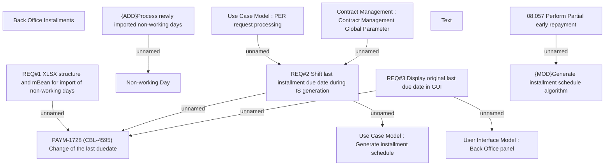

# PAYM-1728 (CBL-4595) Change of the last due date

- **Diagram Type**: Custom
- **Package**: HomerSelect/BSL/Requirements Model/In process/ISPAY/PAYM-1728 (CBL-4595) Change of the last due date
- **Diagram ID**: 113098
- **Elements**: 14
- **Connectors**: 9

