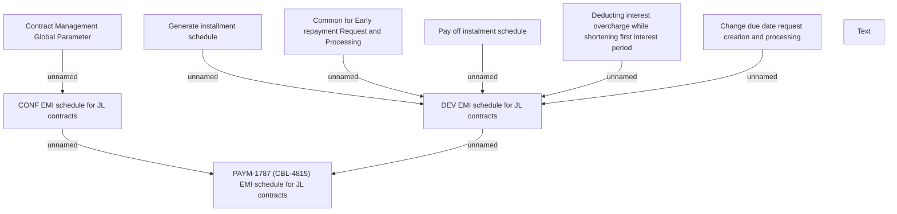

# PAYM-1787 (CBL-4815) EMI schedule for JL contracts

- **Diagram Type**: Custom
- **Package**: HomerSelect/BSL/Requirements Model/In process/ISPAY/PAYM-1787 (CBL-4815) EMI schedule for JL contracts
- **Diagram ID**: 114121
- **Elements**: 10
- **Connectors**: 8

