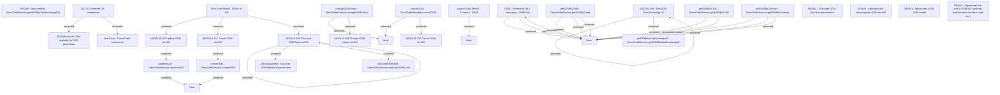

# PAYM-1844 (CBL-1541) - Refactoring of create/updateDDM WS methods

```mermaid
graph TD
    REQ_5_New_method_DirectDebitService_getDDMByDataExchangeID["REQ#5 - New method DirectDebitService.getDDMByDataExchangeID()"]
    getDDMByDataExchangeID_DirectDebitService_getDDMByDataExchan["getDDMByDataExchangeID : DirectDebitService.getDDMByDataExchangeID"]
    ADD_01_588_Get_DDM_Data_Exchange_ID["{ADD}01.588 - Get DDM Data Exchange ID"]
    ADD_01_588_Get_DDM_Data_Exchange_ID["{ADD}01.588 - Get DDM Data Exchange ID"]
    Use_Case_Model_DDM_via_WS["Use Case Model : DDM via WS"]
    Use_Case_Direct_Debit_statements["Use Case : Direct Debit statements"]
    updateDDM_DirectDebitService_updateDDM["updateDDM : DirectDebitService.updateDDM"]
    calculateDDMLimit_DirectDebitService_calculateDDMLimit["calculateDDMLimit : DirectDebitService.calculateDDMLimit"]
    ADD_14_425_Calculate_DDM_limit_via_WS["{ADD}14.425 Calculate DDM limit via WS"]
    ADD_14_425_Calculate_DDM_limit_via_WS["{ADD}14.425 Calculate DDM limit via WS"]
    MOD_Evaluate_DDM_eligibility_for_DDS_generation["{MOD}Evaluate DDM eligibility for DDS generation"]
    n_05_130_Generate_DD_statements["05.130 Generate DD statements"]
    DDM_Generated_JMS_messages_DDM_Info["DDM : Generated JMS messages - DDM Info"]
    Use_Case_Model_DDM_via_WS["Use Case Model : DDM via WS"]
    MOD_14_422_Update_DDM_via_WS["{MOD}14.422 Update DDM via WS"]
    MOD_14_421_Create_DDM_via_WS["{MOD}14.421 Create DDM via WS"]
    ADD_14_424_Change_DDM_status_via_WS["{ADD}14.424 Change DDM status via WS"]
    MOD_14_423_Cancel_DDM_via_WS["{MOD}14.423 Cancel DDM via WS"]
    el_1366470["Note"]
    el_1366476["Note"]
    el_1366475["Note"]
    getDDMByContract_DirectDebitService_getDDMByContract["getDDMByContract : DirectDebitService.getDDMByContract"]
    getDDMByCode_DirectDebitService_getDDMByCode["getDDMByCode : DirectDebitService.getDDMByCode"]
    getDDMByCUID_DirectDebitService_getDDMByCUID["getDDMByCUID : DirectDebitService.getDDMByCUID"]
    changeDDMStatus_DirectDebitService_changeDDMStatus["changeDDMStatus : DirectDebitService.changeDDMStatus"]
    cancelDDM_DirectDebitMandate_cancelDDM["cancelDDM : DirectDebitMandate.cancelDDM"]
    Logical_Data_Model_Contract_DDM["Logical Data Model : Contract - DDM"]
    ADD_Algorithm_Calculate_DDM_limit_from_parameters["{ADD}Algorithm: Calculate DDM limit from parameters"]
    el_1639368["Note"]
    createDDM_DirectDebitService_createDDM["createDDM : DirectDebitService.createDDM"]
    REQ_2_Calculate_DDM_limit_from_parameters["REQ#2 - Calculate DDM limit from parameters"]
    REQ_3_Adjustment_of_create_update_DDM_via_WS["REQ#3 - Adjustment of create/update DDM via WS"]
    REQ_1_Adjustment_DDM_LDM_model["REQ#1 - Adjustment DDM LDM model "]
    REQ_4_Adjustment_the_rest_of_DDM_WS_methods_replacement_the_["REQ#4 - Adjustment the rest of DDM WS methods (replacement the ddm code etc.)"]
    Use_Case_Model_DDM_via_WS -->|unnamed| MOD_14_422_Update_DDM_via_WS
    Use_Case_Model_DDM_via_WS -->|unnamed| MOD_14_421_Create_DDM_via_WS
    DDM_Generated_JMS_messages_DDM_Info -->|unnamed| el_1366475
    DDM_Generated_JMS_messages_DDM_Info -->|unnamed| el_1366475
    updateDDM_DirectDebitService_updateDDM -->|unnamed| el_1639368
    Use_Case_Model_DDM_via_WS -->|unnamed| ADD_14_425_Calculate_DDM_limit_via_WS
    getDDMByCode_DirectDebitService_getDDMByCode -->|unnamed| el_1366475
    Logical_Data_Model_Contract_DDM -->|unnamed| el_1366470
    cancelDDM_DirectDebitMandate_cancelDDM -->|unnamed| el_1366476
    cancelDDM_DirectDebitMandate_cancelDDM -->|unnamed| MOD_14_423_Cancel_DDM_via_WS
    changeDDMStatus_DirectDebitService_changeDDMStatus -->|unnamed| el_1366476
    changeDDMStatus_DirectDebitService_changeDDMStatus -->|unnamed| ADD_14_424_Change_DDM_status_via_WS
    getDDMByCUID_DirectDebitService_getDDMByCUID -->|unnamed| el_1366475
    getDDMByCode_DirectDebitService_getDDMByCode -->|unnamed| el_1366475
    getDDMByCode_DirectDebitService_getDDMByCode -->|unnamed| el_1366475
    getDDMByContract_DirectDebitService_getDDMByContract -->|unnamed| el_1366475
    getDDMByContract_DirectDebitService_getDDMByContract -->|unnamed| el_1366475
    getDDMByContract_DirectDebitService_getDDMByContract -->|unnamed| el_1366475
    el_1366475 -->|unnamed| DDM_Generated_JMS_messages_DDM_Info
    createDDM_DirectDebitService_createDDM -->|unnamed| el_1639368
    getDDMByCUID_DirectDebitService_getDDMByCUID -->|unnamed| el_1366475
    ADD_14_425_Calculate_DDM_limit_via_WS -->|unnamed| ADD_14_425_Calculate_DDM_limit_via_WS
    ADD_14_425_Calculate_DDM_limit_via_WS -->|unnamed| ADD_Algorithm_Calculate_DDM_limit_from_parameters
    ADD_01_588_Get_DDM_Data_Exchange_ID -->|unnamed| ADD_01_588_Get_DDM_Data_Exchange_ID
    n_05_130_Generate_DD_statements -->|unnamed| MOD_Evaluate_DDM_eligibility_for_DDS_generation
    ADD_14_425_Calculate_DDM_limit_via_WS -->|unnamed| calculateDDMLimit_DirectDebitService_calculateDDMLimit
    MOD_14_421_Create_DDM_via_WS -->|unnamed| createDDM_DirectDebitService_createDDM
    MOD_14_422_Update_DDM_via_WS -->|unnamed| updateDDM_DirectDebitService_updateDDM
    ADD_01_588_Get_DDM_Data_Exchange_ID -->|unnamed| getDDMByDataExchangeID_DirectDebitService_getDDMByDataExchan
    n_05_130_Generate_DD_statements -->|unnamed| Use_Case_Direct_Debit_statements
```
