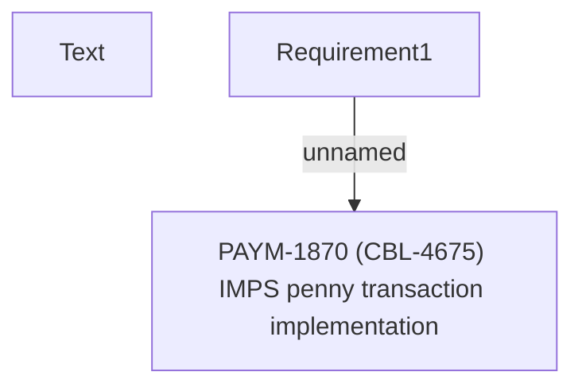

# PAYM-1870 (CBL-4675) IMPS penny transaction implementation

- **Diagram Type**: Custom
- **Package**: HomerSelect/BSL/Requirements Model/In process/ISPAY/PAYM-1870 (CBL-4675) IMPS penny transaction implementation
- **Diagram ID**: 112750
- **Elements**: 3
- **Connectors**: 1

