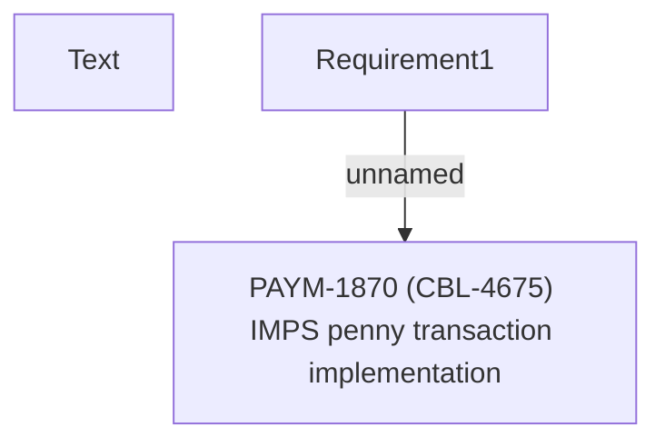

# PAYM-1870 (CBL-4675) IMPS penny transaction implementation

```mermaid
graph TD
    el_1362967["Text"]
    Requirement1["Requirement1"]
    PAYM_1870_CBL_4675_IMPS_penny_transaction_implementation["PAYM-1870 (CBL-4675) IMPS penny transaction implementation"]
    Requirement1 -->|unnamed| PAYM_1870_CBL_4675_IMPS_penny_transaction_implementation
```
