# PAYM-1884 (CBL-4285) - Pairing time for payment made before due date - Interface update

- **Diagram Type**: Custom
- **Package**: HomerSelect/BSL/Requirements Model/In process/ISPAY/PAYM-1884 (CBL-4285) - Pairing time for payment made before due date - Interface update
- **Diagram ID**: 111651
- **Elements**: 24
- **Connectors**: 8

```mermaid
graph TD
    InstallmentPartTypeDto["InstallmentPartTypeDto"]
    InstallmentPartDto["InstallmentPartDto"]
    ApprovalProcessDataResponse["ApprovalProcessDataResponse"]
    ISApprovalProcessDataWS["ISApprovalProcessDataWS"]
    REQ3_LAP_vector_modifications["REQ3: LAP vector modifications"]
    HO_INSTALLMENT_DATA_add_Pretransfer_PT_type["HO_INSTALLMENT_DATA - add Pretransfer (PT) type"]
    InstallmentType["InstallmentType"]
    REQ2_update_data_sources["REQ2: update data sources"]
    AccountDebtInfoDto["AccountDebtInfoDto"]
    DebtCatalogManagementWS["DebtCatalogManagementWS"]
    CalculateDebtResponse["CalculateDebtResponse"]
    AccountBalanceChangeDto["AccountBalanceChangeDto"]
    DebtCatalogDto["DebtCatalogDto"]
    OnlineDebtWS_modifications_for_HoldBalance["OnlineDebtWS - modifications for HoldBalance"]
    InstallmentScheduleWS_InstallmentItem["InstallmentScheduleWS - InstallmentItem"]
    InstallmentScheduleInfoRequest_WriteOffNotification_add_PreT["InstallmentScheduleInfoRequest + WriteOffNotification - add PreTransfer instalment part type"]
    REQ1_update_interfaces["REQ1: update interfaces"]
    AccountBalanceChange_add_holdBalance_value["AccountBalanceChange - add holdBalance value"]
    el_1350880["Boundary"]
    el_1350888["Boundary"]
    el_1350878["Boundary"]
    el_1350886["Boundary"]
    el_1350894["Boundary"]
    el_1350892["Boundary"]
    REQ3_LAP_vector_modifications -->|unnamed| ISApprovalProcessDataWS
    REQ2_update_data_sources -->|unnamed| HO_INSTALLMENT_DATA_add_Pretransfer_PT_type
    REQ1_update_interfaces -->|unnamed| DebtCatalogManagementWS
    REQ1_update_interfaces -->|unnamed| OnlineDebtWS_modifications_for_HoldBalance
    REQ1_update_interfaces -->|unnamed| InstallmentScheduleWS_InstallmentItem
    REQ1_update_interfaces -->|unnamed| InstallmentScheduleInfoRequest_WriteOffNotification_add_PreT
    REQ1_update_interfaces -->|unnamed| AccountBalanceChange_add_holdBalance_value
    InstallmentPartDto -->|unnamed| InstallmentPartTypeDto
```

