# PAYM-1885 (CBL-4285) - VN Pre-transfer 2 - instalment schedule generating, payments pairing, daily pairing job

- **Diagram Type**: Custom
- **Package**: HomerSelect/BSL/Requirements Model/In process/ISPAY/PAYM-1885 (CBL-4285) - Pairing time for payment made before due date - instalment schedule generating, payments pairing, daily pairing job
- **Diagram ID**: 112583
- **Elements**: 41
- **Connectors**: 8

```mermaid
graph TD
    Debt_Catalogue["Debt Catalogue"]
    Incoming_payment_calculations["Incoming payment calculations"]
    Debt_catalogue_calculation_formula["Debt catalogue calculation formula"]
    Debt_catalog_values_on_contract_cancellation["Debt catalog values on contract cancellation "]
    Sum_of_prepayment_calculation["Sum of prepayment calculation"]
    InstallmentPartTypeDto["InstallmentPartTypeDto"]
    Use_Case_Model_Pair_prepayments_to_due_instalments["Use Case Model : Pair prepayments to due instalments"]
    MOD_05_200_Perform_decoupling["{MOD}05.200 Perform decoupling"]
    User_interface_model_Debt_catalogue_detail["User interface model : Debt catalogue detail"]
    Process_pairing_in_due_date["Process pairing in due date"]
    MOD_Contract_Management_Global_Parameter["{MOD}Contract Management Global Parameter"]
    Installment_Part_Type["Installment Part Type"]
    Overdue_Debt_on_Other_Installments["Overdue Debt on Other Installments"]
    REQ1_2_1_align_the_existing_business_rules_on_debt_catalogue["REQ1.2.1 align the existing business rules on debt catalogue"]
    REQ1_2_New_SUMOFPREPAYMENT_in_debt_catalogue_and_New_busines["REQ1.2 New SUMOFPREPAYMENT in debt catalogue and New business rule for its calculation"]
    REQ1_1_Align_existing_debt_catalog_calculations["REQ1.1 Align existing debt catalog calculations"]
    Tab_Payment_channels_Tab_Payment_channels["Tab-Payment channels : Tab-Payment channels"]
    User_Interface_Model_Installment_schedule["User Interface Model : Installment schedule"]
    Automatic_jobs_Automatic_jobs["Automatic jobs : Automatic jobs"]
    REQ3_3_Debt_catalog_detail["REQ3.3 Debt catalog detail"]
    REQ3_2_Payment_channels_screen["REQ3.2 Payment channels screen"]
    REQ3_1_Installment_schedule_detail["REQ3.1 Installment schedule detail"]
    REQ3_GUI_modifications["REQ3: GUI modifications"]
    REQ_2_2_Add_global_parameter_PairToPrepaymentTillDueDate["REQ 2.2 Add global parameter - PairToPrepaymentTillDueDate"]
    Add_Prepayment_generating_and_pairing_in_alg_Keep_pairing_pr["Add Prepayment generating and pairing in alg 'Keep pairing priority' pairing - AW Standard pairing - Prepayment active"]
    Add_Prepayment_generating_and_pairing_in_alg_Standard_pairin["Add Prepayment generating and pairing in alg 'Standard' pairing - AW Standard pairing - Prepayment active"]
    InstallmentPartTypeDto["InstallmentPartTypeDto"]
    REQ_2_3_Add_prepayment_during_pairing["REQ 2.3 Add prepayment during pairing"]
    REQ_2_1_Add_the_Prepayment_PP_installment_part_into_enums["REQ 2.1 Add the Prepayment (PP) installment part into enums"]
    REQ3_daily_pairing_job_repay_due_instalment_by_deduction_fro["REQ3: daily pairing job - repay due instalment by deduction from PrePayment"]
    Keep_priority_pairing["Keep priority pairing"]
    Standard_pairing["Standard pairing"]
    Use_Case_Model_Pairing_installment_parts_procedure["Use Case Model : Pairing installment parts procedure"]
    MOD_05_180_Perform_coupling_payments_with_instalments["{MOD}05.180 Perform coupling payments with instalments"]
    Debt_Catalogue_Debt_catalogue_calculation_formulas_hierarchy["Debt Catalogue : Debt catalogue calculation formulas hierarchy"]
    REQ1_debt_catalogue_calculation_update["REQ1: debt catalogue calculation update"]
    REQ2_Instalment_schedule_prepayment_instalments_generating["REQ2: Instalment schedule - prepayment instalments generating"]
    el_1360918["Boundary"]
    el_1360924["Boundary"]
    el_1360931["Boundary"]
    el_1360914["Boundary"]
    REQ1_2_1_align_the_existing_business_rules_on_debt_catalogue -->|unnamed| Overdue_Debt_on_Other_Installments
    REQ1_2_New_SUMOFPREPAYMENT_in_debt_catalogue_and_New_busines -->|unnamed| REQ1_2_1_align_the_existing_business_rules_on_debt_catalogue
    REQ2_Instalment_schedule_prepayment_instalments_generating -->|unnamed| REQ_2_2_Add_global_parameter_PairToPrepaymentTillDueDate
    REQ2_Instalment_schedule_prepayment_instalments_generating -->|unnamed| REQ_2_3_Add_prepayment_during_pairing
    REQ2_Instalment_schedule_prepayment_instalments_generating -->|unnamed| REQ_2_1_Add_the_Prepayment_PP_installment_part_into_enums
    MOD_05_180_Perform_coupling_payments_with_instalments -->|unnamed| MOD_05_200_Perform_decoupling
    Incoming_payment_calculations -->|unnamed| Debt_catalogue_calculation_formula
    Debt_Catalogue -->|unnamed| Sum_of_prepayment_calculation
```

