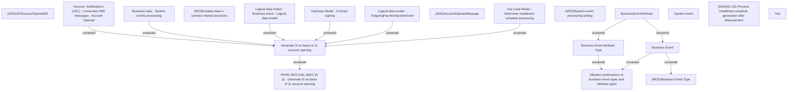

# PAYM-1903 (CBL-4667) IN JL - Generate IS on basis of JL account opening

```mermaid
graph TD
    ADD_JFSAccountOpenedSE["{ADD}JFSAccountOpenedSE"]
    Logical_data_model_OutgoingPaymentSystemEvent["Logical data model : OutgoingPaymentSystemEvent"]
    UseCase_Model_Contract_signing["UseCase Model : Contract signing"]
    MOD_Update_data_in_contract_related_structures["{MOD}Update data in contract related structures"]
    Allowed_combinations_of_business_event_types_and_attribute_t["Allowed combinations of business event types and attribute types "]
    Business_Event_Attribute_Type["Business Event Attribute Type"]
    BusinessEventAttribute["BusinessEventAttribute"]
    MOD_Business_Event_Type["{MOD}Business Event Type"]
    Business_Event["Business Event"]
    Logical_data_model_Business_event_Logical_data_model["Logical data model : Business event - Logical data model"]
    Business_rules_System_events_processing["Business rules : System events processing"]
    ADD_AccountOpenedMessage["{ADD}AccountOpenedMessage"]
    Account_Notifications_CEL_Consumed_JMS_messages_Account_Open["Account  Notifications (CEL) : Consumed JMS messages - Account Opened"]
    MOD_System_event_processing_setting["{MOD}System event processing setting"]
    Use_Case_Model_Determine_installment_schedule_processing["Use Case Model : Determine installment schedule processing"]
    System_event["System event"]
    MOD_01_191_Process_installment_schedule_generation_after_dis["{MOD}01.191 Process installment schedule generation after disbursement"]
    el_1366486["Text"]
    Generate_IS_on_basis_of_JL_account_opening["Generate IS on basis of JL account opening"]
    PAYM_1903_CBL_4667_IN_JL_Generate_IS_on_basis_of_JL_account_["PAYM-1903 (CBL-4667) IN JL - Generate IS on basis of JL account opening"]
    Use_Case_Model_Determine_installment_schedule_processing -->|unnamed| Generate_IS_on_basis_of_JL_account_opening
    Generate_IS_on_basis_of_JL_account_opening -->|unnamed| PAYM_1903_CBL_4667_IN_JL_Generate_IS_on_basis_of_JL_account_
    Logical_data_model_OutgoingPaymentSystemEvent -->|unnamed| Generate_IS_on_basis_of_JL_account_opening
    UseCase_Model_Contract_signing -->|unnamed| Generate_IS_on_basis_of_JL_account_opening
    Logical_data_model_Business_event_Logical_data_model -->|unnamed| Generate_IS_on_basis_of_JL_account_opening
    Business_rules_System_events_processing -->|unnamed| Generate_IS_on_basis_of_JL_account_opening
    Account_Notifications_CEL_Consumed_JMS_messages_Account_Open -->|unnamed| Generate_IS_on_basis_of_JL_account_opening
    BusinessEventAttribute -->|unnamed| Business_Event
    Business_Event -->|unnamed| Allowed_combinations_of_business_event_types_and_attribute_t
    Business_Event -->|unnamed| MOD_Business_Event_Type
    BusinessEventAttribute -->|unnamed| Business_Event_Attribute_Type
    Business_Event_Attribute_Type -->|unnamed| Allowed_combinations_of_business_event_types_and_attribute_t
```
