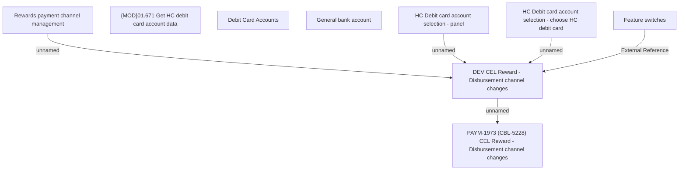

# PAYM-1973 (CBL-5228) CEL Reward - Disbursement channel changes

- **Diagram Type**: Custom
- **Package**: HomerSelect/BSL/Requirements Model/In process/ISPAY/PAYM-1973 (CBL-5228) CEL Reward - Disbursement channel changes
- **Diagram ID**: 115263
- **Elements**: 9
- **Connectors**: 5

