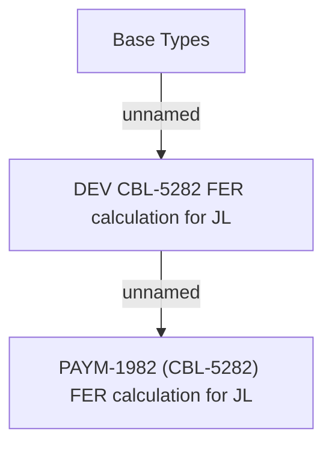

# PAYM-1982 (CBL-5282) FER calculation for JL

- **Diagram Type**: Custom
- **Package**: HomerSelect/BSL/Requirements Model/In process/ISPAY/PAYM-1982 (CBL-5282) FER calculation for JL
- **Diagram ID**: 116562
- **Elements**: 3
- **Connectors**: 2

