# PAYM-2034 (CBL-4285) - Pairing time for payment made before due date - GUI modifications

- **Diagram Type**: Custom
- **Package**: HomerSelect/BSL/Requirements Model/In process/ISPAY/PAYM-2034 (CBL-4285) - Pairing time for payment made before due date - GUI modifications
- **Diagram ID**: 115185
- **Elements**: 19
- **Connectors**: 12

```mermaid
graph TD
    Debt_Catalogue["Debt Catalogue"]
    AccountDebtInfoDto["AccountDebtInfoDto"]
    DebtCatalogDto["DebtCatalogDto"]
    REQ1_2_change_interface["REQ1.2: change interface"]
    REQ1_1_Add_and_compute_new_params_in_DC["REQ1.1 Add and compute new params in DC"]
    REQ1_Add_new_params_in_DC_calculation_and_interface_change["REQ1: Add new params in DC, calculation and interface change"]
    Debt_Catalogue_Debt_catalogue_to_calculation_formulas["Debt Catalogue : Debt catalogue to calculation formulas"]
    Debt_Catalogue_Debt_catalogue_calculation_formulas_hierarchy["Debt Catalogue : Debt catalogue calculation formulas hierarchy"]
    REQ2_Installment_scheduled_change_the_logic_of_Prepaid_Paid_["REQ2: Installment scheduled - change the logic of Prepaid/Paid flag"]
    User_interface_model_Debt_catalogue_detail["User interface model : Debt catalogue detail"]
    REQ5_Debt_catalogue["REQ5: Debt catalogue"]
    Debt_catalogue_information["Debt catalogue information"]
    Tab_Payment_channels_Tab_Payment_channels["Tab-Payment channels : Tab-Payment channels"]
    REQ4_Payment_channel_tab["REQ4: Payment channel tab"]
    Installment_schedule_panel["Installment schedule panel"]
    User_Interface_Model_Installment_schedule["User Interface Model : Installment schedule"]
    REQ3_Installment_schedule_header["REQ3: Installment schedule header"]
    el_1391741["Boundary"]
    el_1391742["Boundary"]
    REQ1_1_Add_and_compute_new_params_in_DC -->|unnamed| Debt_Catalogue_Debt_catalogue_to_calculation_formulas
    REQ2_Installment_scheduled_change_the_logic_of_Prepaid_Paid_ -->|unnamed| User_Interface_Model_Installment_schedule
    REQ1_2_change_interface -->|unnamed| AccountDebtInfoDto
    REQ1_2_change_interface -->|unnamed| DebtCatalogDto
    REQ1_Add_new_params_in_DC_calculation_and_interface_change -->|unnamed| REQ1_1_Add_and_compute_new_params_in_DC
    REQ1_1_Add_and_compute_new_params_in_DC -->|unnamed| Debt_Catalogue_Debt_catalogue_calculation_formulas_hierarchy
    REQ5_Debt_catalogue -->|unnamed| User_interface_model_Debt_catalogue_detail
    Tab_Payment_channels_Tab_Payment_channels -->|unnamed| Debt_catalogue_information
    REQ4_Payment_channel_tab -->|unnamed| Tab_Payment_channels_Tab_Payment_channels
    User_Interface_Model_Installment_schedule -->|unnamed| Installment_schedule_panel
    REQ3_Installment_schedule_header -->|unnamed| User_Interface_Model_Installment_schedule
    REQ1_Add_new_params_in_DC_calculation_and_interface_change -->|unnamed| REQ1_2_change_interface
```

