# PAYM-2067 (CBL-4666) Optimization of AccountBalanceChange message in late EOM processing

- **Diagram Type**: Custom
- **Package**: HomerSelect/BSL/Requirements Model/In process/ISPAY/PAYM-2067 (CBL-4666) Optimization of AccountBalanceChange message in late EOM processing
- **Diagram ID**: 113260
- **Elements**: 8
- **Connectors**: 32

```mermaid
graph TD
    Debt_Catalogue["Debt Catalogue"]
    Logical_Data_Model_Contract_debt_tracking["Logical Data Model : Contract debt tracking"]
    Logical_Data_Model_Mapping_of_AccountBalanceChange_to_Debt_C["Logical Data Model : Mapping of AccountBalanceChange to Debt Catalog"]
    OnlineDebtWS_GetOnlineDebtResponse_Mapping_to_DebtCatalog["OnlineDebtWS : GetOnlineDebtResponse - Mapping to DebtCatalog"]
    AccountBalanceChangeDto["AccountBalanceChangeDto"]
    DebtCatalogDto["DebtCatalogDto"]
    Optimization_of_AccountBalanceChange_message_in_late_EOM_pro["Optimization of AccountBalanceChange message in late EOM processing"]
    PAYM_2067_CBL_4666_Optimization_of_AccountBalanceChange_mess["PAYM-2067 (CBL-4666) Optimization of AccountBalanceChange message in late EOM processing"]
    Optimization_of_AccountBalanceChange_message_in_late_EOM_pro -->|unnamed| PAYM_2067_CBL_4666_Optimization_of_AccountBalanceChange_mess
    Optimization_of_AccountBalanceChange_message_in_late_EOM_pro -->|unnamed| Logical_Data_Model_Mapping_of_AccountBalanceChange_to_Debt_C
    Optimization_of_AccountBalanceChange_message_in_late_EOM_pro -->|unnamed| OnlineDebtWS_GetOnlineDebtResponse_Mapping_to_DebtCatalog
    Optimization_of_AccountBalanceChange_message_in_late_EOM_pro -->|unnamed| Logical_Data_Model_Contract_debt_tracking
    AccountBalanceChangeDto -->|unnamed| Debt_Catalogue
    AccountBalanceChangeDto -->|unnamed| Debt_Catalogue
    AccountBalanceChangeDto -->|unnamed| Debt_Catalogue
    AccountBalanceChangeDto -->|unnamed| Debt_Catalogue
    AccountBalanceChangeDto -->|unnamed| Debt_Catalogue
    AccountBalanceChangeDto -->|unnamed| Debt_Catalogue
    AccountBalanceChangeDto -->|unnamed| Debt_Catalogue
    AccountBalanceChangeDto -->|unnamed| Debt_Catalogue
    AccountBalanceChangeDto -->|unnamed| Debt_Catalogue
    AccountBalanceChangeDto -->|unnamed| Debt_Catalogue
    AccountBalanceChangeDto -->|unnamed| Debt_Catalogue
    AccountBalanceChangeDto -->|unnamed| Debt_Catalogue
    AccountBalanceChangeDto -->|unnamed| Debt_Catalogue
    AccountBalanceChangeDto -->|unnamed| Debt_Catalogue
    AccountBalanceChangeDto -->|unnamed| Debt_Catalogue
    AccountBalanceChangeDto -->|unnamed| Debt_Catalogue
    AccountBalanceChangeDto -->|unnamed| Debt_Catalogue
    AccountBalanceChangeDto -->|unnamed| Debt_Catalogue
    AccountBalanceChangeDto -->|unnamed| Debt_Catalogue
    AccountBalanceChangeDto -->|unnamed| Debt_Catalogue
    AccountBalanceChangeDto -->|unnamed| Debt_Catalogue
    AccountBalanceChangeDto -->|unnamed| Debt_Catalogue
    AccountBalanceChangeDto -->|unnamed| Debt_Catalogue
    AccountBalanceChangeDto -->|unnamed| Debt_Catalogue
    AccountBalanceChangeDto -->|unnamed| Debt_Catalogue
    AccountBalanceChangeDto -->|unnamed| Debt_Catalogue
    AccountBalanceChangeDto -->|unnamed| Debt_Catalogue
    AccountBalanceChangeDto -->|unnamed| Debt_Catalogue
```

